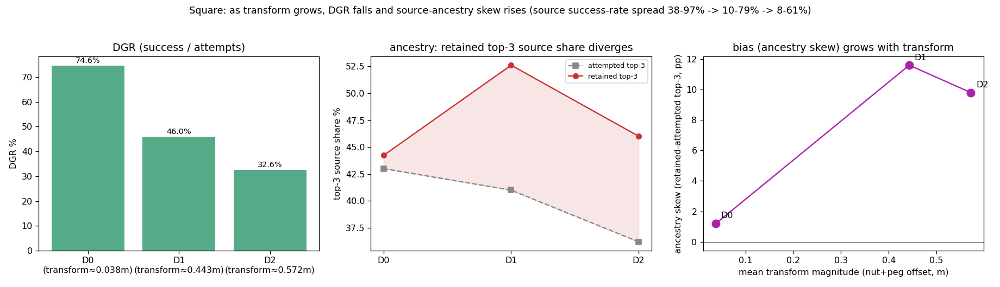
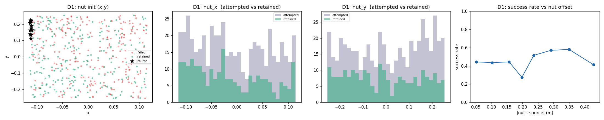
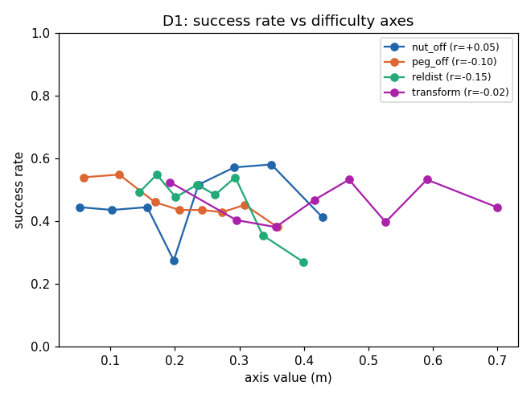
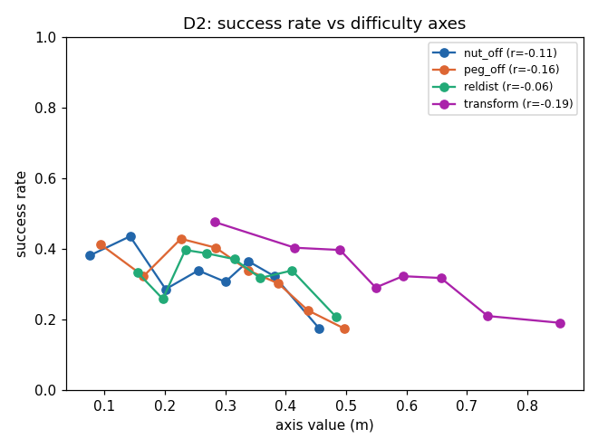
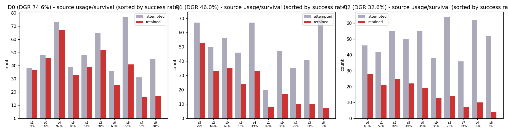

# Motivation Experiment — 성공 필터링이 남기는 편향 (Contribution 1)

MimicGen 계열 합성 데이터 생성은 다양한 초기조건에서 rollout을 **시도**한 뒤 **task 성공한 것만 남긴다(retention)**. 이 실험은 그 필터링이 남겨진 학습 데이터를 어떻게 편향시키는지를, 정책 학습 없이 공개 D0/D1/D2 라벨만으로 정량화한다(Phase-0 retrospective).

**한 줄 결과 (Square)**: 흔히 예상하는 "남은 데이터의 *초기조건 분포*가 쉬운 쪽으로 쏠린다"는 **거의 관측되지 않았다**. 대신 필터링이 만드는 실제 편향은 **"어떤 *원본 데모(source)*의 후손이 살아남나"(ancestry skew)** 였고, 이 편향은 **변형(transform) 크기가 커질수록 함께 커진다**.

> 변형(transform)이 커질수록(D0→D1→D2) 생성 성공률(DGR)은 74.6%→46.0%→32.6%로 떨어지고, retained가 특정 source에 쏠리는 ancestry 편향(retained−attempted top-3 share)은 ~1pp→~12pp로 커진다.

---

## 1. 배경 — 왜 이 실험을 하나

흔히 쓰는 지표 **DGR(data generation rate = 성공/시도)**는 "얼마나 자주 남는가"만 보고 **"무엇이 남는가"**를 못 본다. 같은 DGR이라도 남겨진 데이터의 분포가 다르면 다운스트림 정책 성능이 달라질 수 있다. 그래서 retention이 남겨진 데이터 분포를 어떻게 바꾸는지를 직접 본다.

## 2. 가설과 검증 결과 (요약)

원래 세운 가설과, Square에서 실제로 나온 결과:

| 가설 | 내용 | Square 결과 |
|---|---|---|
| **H1** | retained **초기조건 분포**가 attempted 대비 쉬운 영역(작은 offset)으로 집중 | ❌ **약함** — 전 축에서 retained ≈ attempted 균일 축소 |
| **H2** | 성공률이 초기조건 offset Δ의 감소함수 (dose-response) | ❌ nut offset은 무예측(평평); peg/transform은 **약하게만** 예측 |
| **H3** | D0→D2로 자유도가 커질수록 편향 증가 | ◐ IC 편향은 여전히 약하나, DGR 하락(75→46→33%)과 ancestry 편향은 D1/D2에서 뚜렷 |
| **H4 (실험 중 발견)** | 필터링이 **source-demo ancestry**를 편향 | ✅ **뚜렷** — retained가 "잘 전이되는" source 과대표집 (D1: top-3 41%→53%) |

→ **초기조건 축의 편향(H1/H2)은 약하고, ancestry 축의 편향(H4)이 지배적.**

---

## 3. 실험 설정

### 3.1 대상 태스크
MimicGen 공식 태스크 중 **공개 demo + datagen annotation + D0/D1/D2 세 변형**을 모두 갖춘 **4개**만 사용(코드 검증: `mimicgen/envs/robosuite/*.py`). 제외: D0/D1만(Stack, StackThree, HammerCleanup, MugCleanup, Kitchen, CoffeePreparation), D0만(NutAssembly, PickPlace).

| task | 조작물 / 타겟 |
|---|---|
| **Square** (NutAssemblySquare) — *시작 스콥* | nut / peg |
| Threading | needle / tripod |
| Coffee | mug / machine |
| ThreePieceAssembly | base / piece1,2 |

### 3.2 초기조건 축 · 샘플링
초기조건 = reset 시 각 물체의 pose. 축 = **물체별 (x, y, yaw)**. 각 D변형이 `_get_initial_placement_bounds()`로 범위를 넓힌다. **샘플링은 uniform**(robosuite `UniformRandomSampler`; 다물체는 `ensure_valid_placement=True`라 충돌 배치만 reject → marginal은 사실상 uniform).

**Square** (기준=테이블 (0,0,0.82)):
| 변형 | nut x | nut y | nut yaw | peg |
|---|---|---|---|---|
| D0 | [-0.115,-0.11] (~0.5cm) | [0.11,0.225] (~11cm) | 0–360° | **고정** |
| D1 | [-0.115,0.115] (23cm) | [-0.255,0.255] (51cm) | 0–360° | x[-0.1,0.3], y[-0.2,0.2], yaw 고정 |
| D2 | [-0.25,0.25] (50cm) | [-0.25,0.25] (50cm) | 0–360° | x,y[-0.25,0.25], yaw 0–90° |

**공통 패턴**: D0 = 물체 1개만 좁게, 나머지 고정 → D1 = 주 물체 넓게 + **타겟도 랜덤화** → D2 = 전부 넓게 + 타겟 회전까지. (Threading/Coffee/ThreePiece 축은 부록 참조 — Coffee 정확 수치는 실행 시 추출.)

### 3.3 생성 · 로깅
- MimicGen 공식 `generate_dataset.py` (커스텀 생성기 없음 — 공정성).
- (변형)마다 **500 attempts** 고정: `num_trials=500`, `guarantee=False`(성공이 아니라 시도 500), **`keep_failed=True` + `max_num_failures=500`**(성공·실패 전량 저장).
- source demo = 공개 10개(D0 분포에서 수집), 동일 10개로 D0/D1/D2 생성.
- **attempt마다 전량 로깅**: `initial_state`, `datagen_info.object_poses`(=초기조건), `states`, 저차원 `obs`, `actions`, `src_demo_inds`(어떤 source 변환했는지), 성공 라벨(demo.hdf5 vs demo_failed.hdf5). 이미지 obs는 states에서 재렌더 가능하므로 생략(재실행 불필요).

---

## 4. 결과 — Square (D0/D1/D2, 각 500 attempts)

| 변형 | DGR | nut offset Δ (att→ret) | peg offset Δ | **IC 위치 편향** | **ancestry 편향** (ret top-3 vs att top-3) |
|---|---|---|---|---|---|
| D0 | 74.6% (373/500) | 0.038→0.037 | 0 (peg 고정) | **없음** (전 축 W≈0) | 44% vs 43% (없음) |
| D1 | 46.0% (230/500) | 0.227→0.234 | 0.216→0.205 | **매우 약함** (std 축소 1–6%) | **53% vs 41%** |
| D2 | 32.6% (163/500) | 0.268→0.250 | 0.303→0.274 | **약함** | **46% vs 36%** |

### 4.1 초기조건 위치 편향은 약하다 (H1/H2 반증)
성공/실패가 nut (x,y) 박스 전체에 **섞여** 있고, nut_x·nut_y marginal은 attempted를 **균일 축소**한 수준이며, 성공률=f(nut offset) dose-response는 **평평**. 즉 "특정 초기조건이 쉬워서 살아남는다"는 신호가 거의 없다.

> D1: (좌) nut(x,y) 성공(초록)/실패(빨강)/source(별)가 박스 전체에 섞임 · (중) nut_x·nut_y marginal에서 retained(초록)는 attempted(보라)의 균일 축소 · (우) 성공률 vs nut offset은 평평. (D0/D2도 동일 경향: `square_D0_ic.png`, `square_D2_ic.png`.)

### 4.2 그럼 왜 D0→D1→D2로 어려워지나 (DGR 75→46→33%)
특정 위치가 함정인 게 아니라, **변형 크기(transform)와 움직이는 peg** 때문이다. 성공을 예측하는 축을 point-biserial 상관으로 비교(음수=클수록 실패):

| 축 | D0 | D1 | D2 |
|---|---|---|---|
| nut_off (nut을 source에서 옮긴 거리) | -0.06 | **+0.05** | -0.11 |
| peg_off (peg를 옮긴 거리) | 0(고정) | **−0.10** | **−0.16** |
| reldist (nut–peg 초기 거리) | -0.07 | **−0.15** | -0.06 |
| transform (총 변형 nut_off+peg_off) | -0.06 | -0.02 | **−0.19** |

- **nut 위치/offset은 성공 무예측** (평평 확인). **peg offset·nut–peg 상대거리·총 transform은 예측**(음의 상관, D1→D2로 강해짐).
- 즉 D0는 **peg 고정 + near-replay**(nut offset 0.038)라 쉽고, D1/D2는 **peg를 옮기고 변형을 키워** 영역 전체가 **균일하게** 더 어려워진다(특정 지점 아님). 변형 안에서 nut offset이 평평한 이유도 이미 전체가 large-transform 레짐이라 미세 위치가 무의미하기 때문.
- **단 이 상관들은 모두 약함(|r|≤0.2)** → IC 기하는 성공을 약하게만 결정.

> 성공률 vs 4개 축(nut_off·peg_off·reldist·transform). **nut_off는 평평**, **peg_off·nut–peg 상대거리·transform은 음의 기울기**(클수록 실패), D1→D2로 뚜렷해짐.

### 4.3 진짜 편향 = source-demo ancestry
(a) source **사용 자체가 uniform 아님**(selection strategy; uniform이면 50/source), (b) **source별 성공률 편차 큼**, (c) 필터링이 "잘 전이되는" source를 **과대표집**. D0(성공률 편차 작음)엔 미미, **D1/D2에서 뚜렷**. [[mimicgen-failure-audit]]의 "Gear D1 850/1000 from 3"와 같은 축.

**D1 (DGR 46%)** — source 성공률 내림차순:
| src | attempted | retained | succ% | ret share% |
|---:|---:|---:|---:|---:|
| 5 | 67 | 53 | 79 | 23.0 |
| 2 | 50 | 33 | 66 | 14.3 |
| 0 | 56 | 35 | 62 | 15.2 |
| 6 | 46 | 24 | 52 | 10.4 |
| 4 | 67 | 33 | 49 | 14.3 |
| 1 | 20 | 8 | 40 | 3.5 |
| 9 | 47 | 17 | 36 | 7.4 |
| 7 | 35 | 10 | 29 | 4.3 |
| 3 | 41 | 10 | 24 | 4.3 |
| 8 | 71 | 7 | 10 | 3.0 |

→ retained top-3 = **53%** (attempted 41%), 성공률 **10–79%**.

**D2 (DGR 33%)** — source 성공률 내림차순:
| src | attempted | retained | succ% | ret share% |
|---:|---:|---:|---:|---:|
| 6 | 46 | 28 | 61 | 17.2 |
| 1 | 42 | 21 | 50 | 12.9 |
| 2 | 55 | 25 | 46 | 15.3 |
| 5 | 50 | 22 | 44 | 13.5 |
| 0 | 55 | 19 | 34 | 11.7 |
| 9 | 38 | 13 | 34 | 8.0 |
| 3 | 64 | 14 | 22 | 8.6 |
| 7 | 36 | 7 | 19 | 4.3 |
| 4 | 62 | 10 | 16 | 6.1 |
| 8 | 52 | 4 | 8 | 2.5 |

→ retained top-3 = **46%** (attempted 36%), 성공률 **8–61%**. (D0: 44% vs 43%, 성공률 38–97% — 미미.)

주목: source 8은 D1·D2 모두 **가장 많이 시도(71/52회)되나 가장 안 살아남음**(10%/8%). source 5는 상위 일관.

> source별 attempted(회색) vs retained(빨강), 성공률 내림차순 정렬. D0(좌)는 두 막대가 나란함(편향 없음), **D1·D2(중·우)는 성공률 낮은 source(오른쪽)에서 retained가 급감** = 필터링이 잘 전이되는 source로 조상을 몰아줌.

---

## 5. 핵심 결론

1. **retention이 만드는 편향은 "어떤 초기조건이 남나"(IC 분포)가 아니라 "어떤 source의 후손이 남나"(ancestry)이다** — 적어도 Square에서. IC 위치 marginal은 거의 안 쏠리고, source 조상 분포는 뚜렷이 쏠린다.
2. **D0→D1→D2 난이도 상승과 ancestry 편향은 같은 뿌리** — 변형이 커질수록(peg 이동 + transform↑) source별 "전이 품질" 차이가 드러나, 잘 전이되는 source만 살아남는다. D0(near-replay)에선 어중간한 source도 성공해 편향이 없다.
3. **DGR은 이 편향을 못 본다** — 같은 500 시도에서 DGR만 보면 "어떤 원본이 데이터를 지배하는지"를 놓친다. 이것이 이 실험이 보이려는 gap.

## 6. 데이터 · 재현
- **위치 (aidas `3.151.29.145`)**: `~/mimicgen_jihoonkwon/experiments/motivation_ic/square_{D0,D1,D2}/.../{demo.hdf5, demo_failed.hdf5}`, 분석 산출 `analysis/{stats.json, square_*_ic.png, square_*_difficulty.png}`
- **환경**: `robosuite_mimicgen/venv` (robosuite 1.4.1, robomimic 0.3.1, mimicgen `72bd767`, mujoco 2.3.2, numpy 1.23.5), CPU.
- **스크립트**: `run_square_motiv2.sh`(생성) · `analyze_motivation_ic.py`(IC 분포·ancestry) · `analyze_difficulty_axes.py`(난이도 축).

## 7. 다음 단계
- **ancestry 편향의 다운스트림 영향**: 조상 편향이 정책 성능을 실제로 해치는지(coverage 손실) — 이게 논문의 다음 연결고리.
- **다른 task 확장**: Threading / Coffee / ThreePieceAssembly (다물체 → 편향 더 강할 것 예상), 이후 Gear(memory의 850/1000 사례).
- **IC 편향이 강한 레짐 탐색**: Square는 IC-robust했음. 더 tight-clearance / 다물체 task에서 IC 위치 편향도 나타나는지.
</content>
