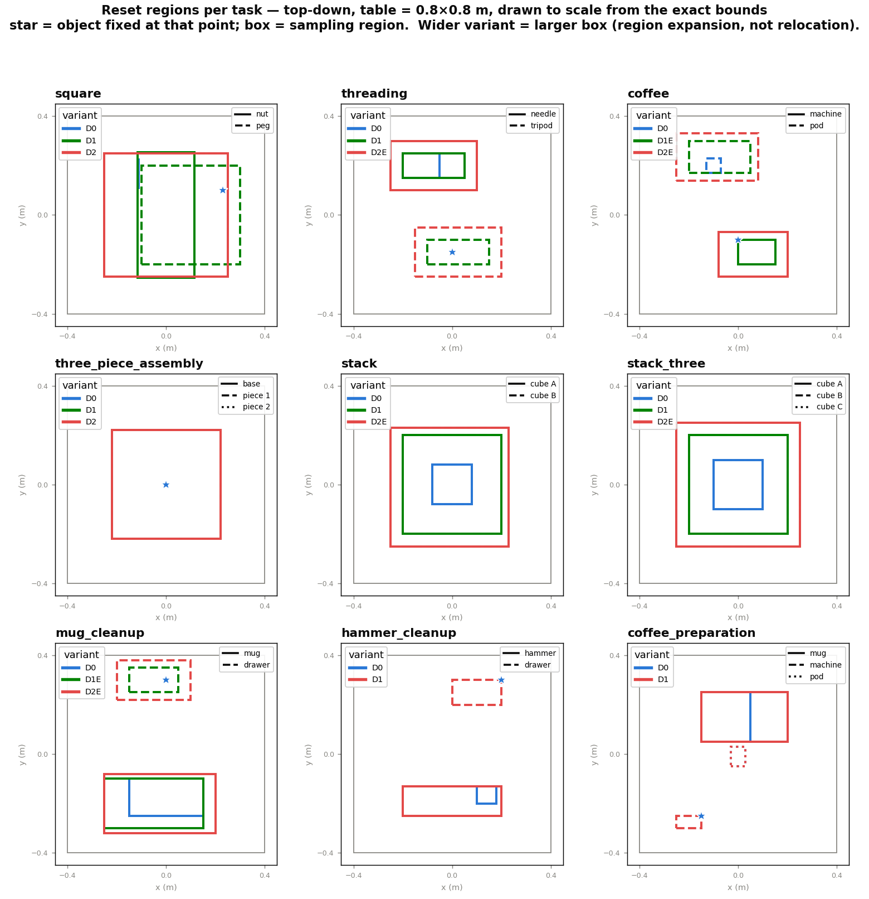
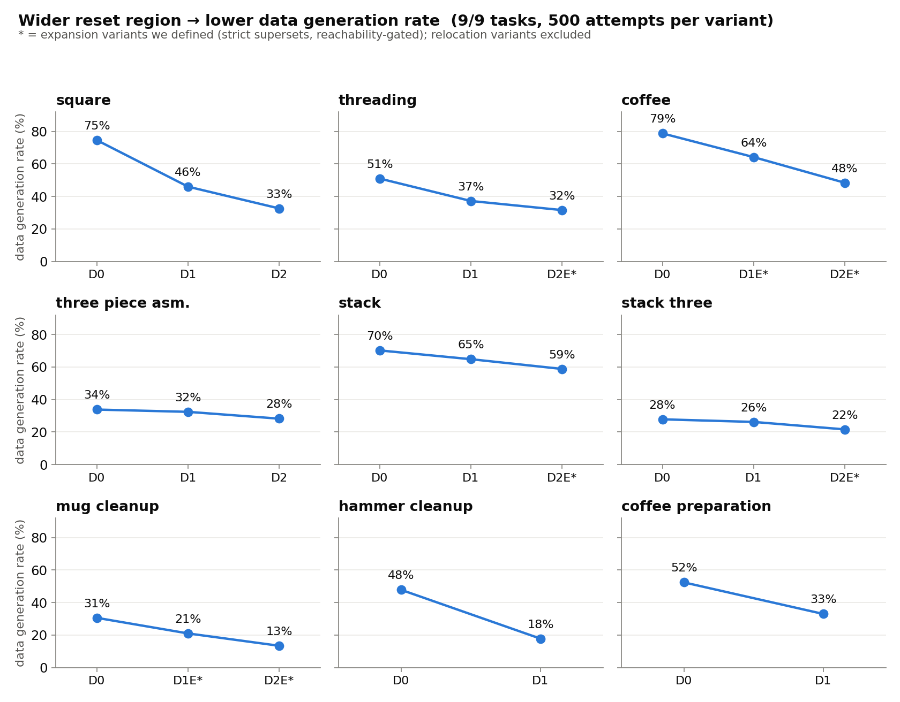
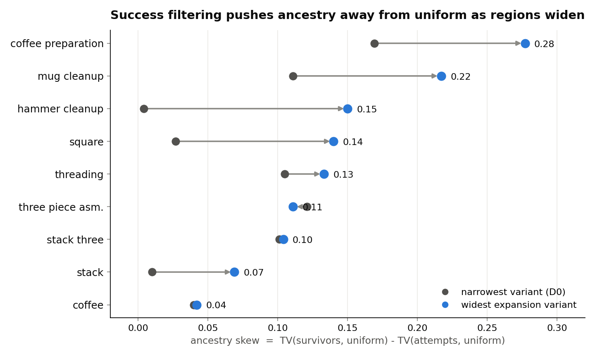

# Bias in Synthetic Data Generation - Motivation 실험 (2): Task 확장

## Recall

### 무엇을 하려는 연구인가

로봇에게 어떤 일을 시키려면 사람이 직접 조종해 보여준 시연(demonstration, 이하 데모)을 로봇이 흉내 내도록 학습시킨다. 이것을 모방학습이라고 한다. 그런데 로봇이 실제로 마주하는 상황은 매번 다르다 — 집을 물체가 테이블 위 어디에 놓여 있느냐에 따라 팔을 뻗는 방향과 손목을 트는 각도가 전부 달라진다. 그래서 소수의 데모만으로는 부족하고, 물체 위치가 조금씩 다른 수많은 상황을 담은 큰 데모 데이터셋이 필요하다.

사람이 그 많은 데모를 일일이 다 만드는 것은 비용이 크다. 그래서 소수의 사람 데모를 자동으로 불려서 합성 데모를 대량으로 만드는 방법이 쓰인다. 이 연구에서 다루는 **MimicGen**이 그런 방법의 대표격이다.

### MimicGen이 합성 데모를 만드는 방식

MimicGen은 사람 데모 하나를 그대로 복사하는 게 아니라, 물체 위치가 다른 새 장면에 맞게 **변형해서** 재사용한다. 절차는 세 단계다.

- **자르기** — 사람 데모를 "물체 하나를 다루는 구간" 단위로 쪼갠다(예: 너트를 집는 구간, 페그에 끼우는 구간). 이 구간을 subtask segment라고 부른다.
- **변형(transform)** — 새 장면에서 물체가 놓인 위치에 맞춰, 원본 구간의 로봇 손 궤적을 통째로 옮기고 회전시킨다. 원본에서 "너트를 기준으로 이렇게 움직였다"는 상대적 궤적을 유지한 채, 새 너트 위치에 맞게 좌표만 바꾸는 것이다.
- **이어붙이고 성공만 남기기(retain)** — 변형한 구간들을 부드럽게 연결해 실제로 시뮬레이터에서 실행해 보고, **task에 성공한 것만** 데이터셋에 넣는다. 실패한 것은 버린다.

새 장면의 물체 위치는 미리 정한 **초기 배치 영역(reset region)** 안에서 무작위로 뽑는다. 이 영역을 좁게 잡으면(원본 데모와 비슷한 위치들만) 쉬운 데이터가, 넓게 잡으면(원본과 멀리 떨어진 위치까지) 어려운 데이터가 나온다. MimicGen은 태스크마다 좁은 영역부터 넓은 영역까지 몇 단계의 난이도 변형을 제공하는데, 관례적으로 **D0**(가장 좁음) → **D1** → **D2**(가장 넓음) 로 이름 붙인다.

### 이 연구가 의심하는 지점

문제는 마지막 단계, "성공한 것만 남기기"다. 이 방법이 잘 되는지를 재는 표준 지표는 **DGR**(data generation rate, 데이터 생성 성공률)로, 생성을 시도한 횟수 중 성공해서 데이터셋에 남은 비율이다. 그런데 DGR은 "얼마나 자주 남는가"만 알려줄 뿐 **"무엇이 남는가"** 는 말해주지 않는다. 만약 성공하기 쉬운 특정 조건의 데모만 살아남는다면, 최종 데이터셋은 원래 넓게 탐색했던 다양성을 잃어버린다. DGR이 같아도 이런 편향의 정도는 얼마든지 다를 수 있고, 그 편향은 결국 이 데이터로 학습한 로봇의 성능에 영향을 준다.

### 지난 실험에서 관찰한 것 (4개 task)

지난 보고서에서 MimicGen이 데모와 주석을 잘 제공하는 4개 태스크(Square, Three Piece Assembly, Threading, Coffee)를 골라, 난이도 변형(D0/D1/D2)마다 합성 데모 생성을 500번씩 시도하고 성공·실패를 전부 기록해서 두 가지를 관찰했다.

- **관찰 1** — 원본 데모의 물체 배치와 합성 장면의 물체 배치가 멀수록, 즉 더 큰 변형이 필요할수록 생성 성공률(DGR)이 낮아진다.
- **관찰 2 (Ancestry Bias, 조상 편향)** — 변형이 커질수록, 성공해서 남는 합성 데모가 소수의 "잘 옮겨지는" 원본 데모의 후손으로 쏠린다. MimicGen은 원본의 궤적을 규칙대로 변형해 쓰므로, 이 쏠림은 결국 로봇이 배우는 동작 궤적(action trajectory)의 다양성 손실로 이어질 수 있다.

## 이번 실험의 질문

> 위의 두 관찰이 4개 task에서만 우연히 나온 것인가, 아니면 성공-필터링 방식으로 데이터를 만드는 한 일반적으로 나타나는 성질인가?

이번 주에는 태스크를 9개로 늘려 같은 실험을 반복했다. **핵심 메시지를 먼저 말하면, 태스크를 넓혀도 두 관찰이 모두 유지된다.** 9개 태스크 전부에서 초기 배치 영역을 넓힐수록 DGR이 떨어졌고(예외 0개), 필터링 압력이 큰 태스크일수록 조상 편향이 더 심했다.

## 두 가지 지표의 정의

결과를 보기 전에, 이번 실험이 재는 두 지표를 명확히 해둔다.

### 지표 1 — 변형 거리 (transform distance)

**한 줄 정의**: 어떤 합성 시도에서, 각 물체가 원본 데모에서 놓였던 위치와 지금 합성 장면에서 놓인 위치가 얼마나 떨어져 있는지를 잰 값. 물체가 여럿이면 각 물체의 거리를 합친다.

- **왜 이 값인가** — MimicGen은 원본 궤적을 새 물체 위치로 "옮겨서" 쓴다. 옮기는 거리가 멀수록 원본 궤적을 많이 왜곡해야 하고, 그만큼 실행이 어긋나 실패하기 쉽다. 그래서 이 거리가 곧 "이 시도가 얼마나 어려운 변형인가"의 척도가 된다.
- **어떻게 재는가** — 한 합성 시도가 시작될 때 각 물체의 초기 위치를 기록해 두면, 그 시도가 어느 원본 데모에서 왔는지도 함께 기록되므로(아래 조상 편향 참조), "원본에서의 그 물체 위치"와 "지금 위치"의 직선거리를 물체마다 계산해 합한다. 단위는 미터다. 예를 들어 Square에서 너트가 원본보다 20cm, 페그가 15cm 떨어진 곳에 놓였다면 이 시도의 변형 거리는 0.35m다.
- **태스크 간 비교를 위한 정규화** — 태스크마다 물체 크기와 영역 크기가 다르므로, 태스크끼리 겹쳐 비교할 때는 각 물체의 거리를 그 물체가 놓일 수 있는 영역의 대각선 길이로 나눠 0~1 사이 값으로 바꾼다(0 = 원본과 같은 자리, 1 = 그 영역에서 갈 수 있는 가장 먼 곳). 다만 한 태스크 안에서의 경향을 볼 때는 미터 단위와 정규화 값이 사실상 같은 결과를 주는 것을 확인했으므로(9개 태스크 모두에서 두 정의의 상관 차이가 0.003 이하), 본문에서는 직관적인 미터 단위로 이해하면 된다.

이 실험에서 난이도 변형 D0 → D1 → D2는 결국 "변형 거리 분포를 오른쪽으로(더 멀게) 미는" 조작이다. 좁은 D0 영역에서는 물체가 원본 근처에만 놓이므로 변형 거리가 작고, 넓은 D2 영역에서는 멀리까지 놓이므로 변형 거리가 커진다.

### 지표 2 — 조상 편향 (ancestry skew)

**배경 개념**: 합성 데모 하나하나는 반드시 원본 데모 10개 중 **어느 하나**를 변형해서 만든 것이다. 그 "부모" 원본을 이 데모의 **조상(ancestry)** 이라고 부른다. MimicGen은 매 시도마다 원본을 무작위로 고르므로, **시도 단계에서는** 10개 원본이 거의 고르게 쓰인다(각각 약 10%). 문제는 성공해서 **살아남은** 데모들의 조상 분포다. 특정 원본이 유난히 잘 성공한다면, 최종 데이터셋은 그 소수 원본의 후손으로 채워진다.

**한 줄 정의**: 살아남은 데모에서 상위 3개 조상이 차지하는 비중이, 시도 단계에서 상위 3개 조상이 차지했던 비중보다 얼마나 커졌는지(단위: %포인트).

- **왜 상위 3개인가** — 원본이 10개이므로 완전히 고르면 어느 3개든 30%를 차지한다. "살아남은 쪽의 상위 3개 비중 − 시도 단계 상위 3개 비중"이 0에 가까우면 필터링이 조상을 거의 안 건드린 것이고, 이 값이 클수록 소수 조상으로 쏠린 것이다. 시도 단계 값을 빼주는 이유는, 무작위 선택이라도 우연히 생기는 약간의 불균형을 기준선으로 상쇄하고 **필터링이 추가로 만든 쏠림만** 보기 위해서다.
- **함께 보는 값: 유효 조상 수 (n_eff)** — 살아남은 데모의 조상 분포가 실질적으로 원본 몇 개에서 나온 셈인지를 하나의 숫자로 요약한 것이다(분포가 완전히 고르면 10, 한 원본에 다 쏠리면 1). 예를 들어 뒤에 나오는 mug cleanup의 가장 넓은 변형에서는 이 값이 6.9로, 원본 10개 중 실질적으로 7개 정도만 데이터에 기여한 셈이다.
- **왜 중요한가** — 이 편향은 "어떤 물체 위치가 데이터에 많고 적은가"(초기조건의 편향)와는 다른, 한 겹 더 깊은 편향이다. 조상이 쏠린다는 것은 곧 그 소수 원본의 **동작 방식**이 데이터를 지배한다는 뜻이고, 로봇이 배우는 행동의 다양성이 좁아질 수 있다.

## 이번에 정비한 것 두 가지

태스크를 늘리기 전에, 지난 실험에서 걸렸던 문제 두 가지를 먼저 정리했다.

**첫째, "영역 확장"과 "영역 이동"을 분리했다.** MimicGen이 공개한 난이도 변형 중 일부는 영역을 넓히는 게 아니라 물체를 테이블 반대편으로 **옮긴다**(예: 공개된 Threading D2는 바늘과 삼각대의 좌우를 통째로 뒤집는다). 이러면 "원본에서 멀어져서 어려운 것"과 "아예 새로운 영역이라 어려운 것"이 섞여 해석이 오염된다. 그래서 이런 태스크에는 **이전 단계 영역을 온전히 포함하면서 넓히기만 하는 확장 변형**을 새로 정의하고 이름 끝에 E를 붙였다(D1E, D2E). 넓힐 수 있는 한계는 감이 아니라 검증으로 정했다 — 후보 영역의 극단 위치(모서리 네 곳, 집는 물체는 변 중앙 네 곳 추가)에 물체를 고정하고 각 50번씩 생성을 시도해서, "그리퍼가 물체에 도달해 첫 단계를 완수하는 비율"이 영역 안쪽과 비슷할 때만 그 경계를 확정했다. 이 관문에서 실제로 두 군데가 걸렸고(coffee는 두 물체 영역이 중앙에서 마주보는 안쪽 모서리에서 팔 진로가 막혔고, stack은 로봇 팔 길이 한계인 원거리 모서리였다), 규칙대로 해당 경계를 2cm씩 줄여 통과시켰다.

**둘째, 생성 설정을 전 태스크 동일하게 통일했다.** 원본 데모 선택을 무작위로, 그리고 한 합성 데모에는 원본 하나만 쓰도록 고정했다. 일부 태스크의 공개 설정은 현재 장면과 가장 비슷한 원본을 골라주는데, 그러면 시도 자체가 원본 근처로 쏠려 변형 거리와 조상이 하나로 정의되지 않기 때문이다. 이 변경의 영향은 Square에서 확인했다 — 무작위 선택으로 재실행한 DGR 21.0%는 MimicGen 논문의 같은 조건 값 22.4%와 잘 맞았다.

## Task & 변형 구성

각 태스크의 초기 배치 영역을 위에서 내려다본 그림이다. 상자가 물체가 놓일 수 있는 영역이고(색 = 변형 단계), 별표는 그 변형에서 고정된 물체다. 변형 단계가 올라갈수록 상자가 이전 상자를 **감싸며 커지는 것**(이동이 아니라 확장)을 볼 수 있다.

| task | 하는 일 | 난이도 사다리 | 비고 |
|---|---|---|---|
| Square | 너트를 집어 페그에 끼움 | D0 → D1 → D2 | 공개 변형이 이미 확장형 |
| Threading | 바늘을 삼각대 구멍에 통과 | D0 → D1 → **D2E** | 공개 D2가 좌우 반전이라 확장판 신설 |
| Coffee | 커피 팟을 머신에 넣고 닫음 | D0 → **D1E** → **D2E** | 공개 D1·D2 모두 이동/반전이라 신설 |
| Three Piece Assembly | 베이스에 두 조각 조립 | D0 → D1 → D2 | 위치가 아니라 회전으로 확장되는 태스크 |
| Stack | 큐브 2개 쌓기 | D0 → D1 → **D2E** | 공개는 D1까지라 한 단계 신설 |
| Stack Three | 큐브 3개 쌓기 | D0 → D1 → **D2E** | 상동 |
| Mug Cleanup | 머그를 서랍에 넣고 닫음 | D0 → **D1E** → **D2E** | 공개 D1이 머그 영역을 옆으로 밀어 신설 |
| Hammer Cleanup | 망치를 서랍에 넣고 닫음 | D0 → D1 | 공개 2단 사다리 |
| Coffee Preparation | 머그 배치 후 팟을 꺼내 끼움 (5단계) | D0 → D1 | 공개 2단 사다리, 긴 태스크 대표 |

굵은 글씨가 이번에 새로 정의한 확장 변형이다. 모든 변형에서 시도 500번 고정, 성공·실패 전부 기록, 원본 데모는 각 태스크의 공개 10개를 그대로 썼다. (Three Piece Assembly는 D0→D1에서 베이스가 고정에서 이동으로 풀리고 D1→D2에서 조각들의 회전이 풀리는 식이라, 위 그림에서는 위치 상자가 겹쳐 보인다 — 확장이 위치가 아니라 회전 축에서 일어나는 태스크다.)

## 결과 1 — 영역을 넓힐수록 생성 성공률이 떨어진다 (9/9 task)

- **9개 태스크 전부에서 단조 하락, 예외 없음** — 초기 배치 영역을 순수하게 넓히기만 해도(반대편 이동 없이) 생성 성공률이 한 단계도 오르는 일 없이 떨어진다. 지난 실험의 관찰 1이 특정 태스크의 우연이 아니라 성공-필터링 생성 일반의 성질임을 보여준다.
- **하락 폭은 태스크마다 다르다** — 쉬운 태스크는 완만하고(stack 70→59%), 정밀 삽입이나 긴 단계가 낀 태스크는 가파르다(hammer cleanup 48→18%, mug cleanup 31→13%). 이 차이가 아래 결과 2의 열쇠가 된다.

## 결과 2 — 필터링 압력이 클수록 특정 원본으로의 쏠림이 심해진다

가로축은 조상 편향(살아남은 데모의 상위 3개 조상 비중 − 시도 단계 상위 3개 비중, %포인트)이다. 회색 점이 가장 좁은 변형(D0), 파란 점이 가장 넓은 확장 변형이고, 화살표 길이가 곧 "영역을 넓혔을 때 쏠림이 얼마나 커졌는가"다.

- **영역을 넓히면 쏠림이 커진다** — 이번에 추가한 태스크들에서 특히 뚜렷하다. coffee preparation은 +12.7 → +25.8%p, mug cleanup은 +9.6 → +21.4%p, hammer cleanup은 +0.5 → +15.2%p로 벌어진다.
- **쉬운 태스크에서는 쏠림이 거의 없다** — stack(+4)과 coffee(+2)처럼 성공률이 높은 태스크는 어중간한 원본도 살아남으므로 조상이 고르게 유지된다. 지난 실험에서 본 "필터링 압력이 커야 원본 간 품질 차이가 드러난다"는 메커니즘 그대로다. 결과 1의 하락 폭과 결과 2의 쏠림이 같은 방향으로 움직인다.

가장 심한 mug cleanup의 가장 넓은 변형(D2E)을 예로 보면, 시도는 원본별로 42~60회로 고른데 **살아남은 65개 중 절반 이상(55%)이 상위 3개 원본에서 나왔고, 10개 중 2개 원본은 후손을 거의 또는 전혀 남기지 못했다**(s7은 56번 시도해 생존 0). 유효 조상 수로 환산하면 좁은 D0에서 8.5개였던 것이 D2E에서 6.9개로 줄어, 원본 10개 중 실질적으로 7개 정도만 데이터에 기여한 셈이다.

| 원본 (Src) | 시도 (Attempted) | 생존 (Retained) | 성공률 | 살아남은 데이터 중 비중 |
|---|---|---|---|---|
| s2 | 44 | 14 | 32% | 22% |
| s4 | 60 | 12 | 20% | 18% |
| s6 | 54 | 10 | 19% | 15% |
| s3 | 45 | 7 | 16% | 11% |
| s8 | 42 | 6 | 14% | 9% |
| s5 | 53 | 7 | 13% | 11% |
| s9 | 46 | 5 | 11% | 8% |
| s1 | 47 | 3 | 6% | 5% |
| s0 | 53 | 1 | 2% | 2% |
| s7 | 56 | 0 | 0% | **0%** |

## 참고 — 공개된 "이동" 변형은 어떻게 확인됐나

지난 보고서에서 "일부 태스크는 분포가 대칭 이동이라 거리-성공률 경향이 안 보인다"고 판단했는데, 이번에 그 판단을 정량으로 확인했다. 두 영역을 합친 박스로 변형 거리를 다시 정규화해 보면, 이동 변형의 물체 배치는 확장 변형의 거리 범위와 **아예 겹치지 않는, 모든 원본에서 순수하게 더 먼 구간**을 차지한다(Threading의 경우 확장은 정규화 거리 0.37 이하, 이동은 0.48 이상). 확장 쪽의 거리-성공률 추세를 그 먼 구간까지 연장해 비교하면, Threading(위치만 반전)은 실측과 잘 맞고(예측 24.1% vs 실측 22.0%), Coffee(머신이 놓인 방향까지 약 180° 뒤집힘)는 실측이 예측보다 27.9%p 낮다. 즉 위치 변형 거리가 난이도의 1차 설명변수이되, 방향 반전 같은 자세 변화는 별도의 추가 난이도라는 부수 확인이다. 이번 실험의 확장 변형은 이런 이동·반전을 배제했으므로 결과 1의 거리-성공률 관계가 오염 없이 나온 것이다.

## Takeaway & Next Step

**Takeaway:**

- **두 관찰이 일반화됐다** — "영역을 넓힐수록 생성 성공률이 떨어진다"(9/9 태스크, 예외 0)와 "필터링 압력이 클수록 특정 원본의 후손으로 쏠린다"(최대 +25.8%p)가 태스크 4개에서 9개로 늘려도 유지된다. 4개 태스크의 우연이 아니라 성공-필터링 생성 방식 일반의 성질로 볼 근거가 생겼다.
- **쏠림의 크기가 처음으로 스펙트럼으로 잡혔다** — "거의 0인 태스크"(stack, coffee)부터 "실질 조상의 3분의 1이 사라지는 태스크"(mug cleanup, coffee preparation)까지. 필터링 압력(낮은 DGR)과 쏠림이 같이 움직이므로, 앞으로 어떤 태스크에서 이 편향을 걱정해야 하는지 예측할 단서가 된다.

**Next Step:** 그렇다면 이 편중이 로봇의 최종 성능(policy 성능)을 실제로 깎는가? 이를 확인하는 정책 실험이 이미 돌아가고 있다.

- 4개 태스크의 가장 넓은 변형에서 시도 6,250번짜리 큰 시도 풀을 만든다(성공·실패 전부 기록).
- 같은 풀에서 세 가지 학습 데이터셋을 500개씩 뽑는다 — ① 그냥 무작위 500개(표준 파이프라인), ② 원본과의 변형 거리 구간별로 고르게 뽑은 500개, ③ 조상이 고르게 되도록 뽑은 500개. 같은 풀에서 뽑으므로 셋의 차이는 오직 "어떤 500개를 남겼나"뿐이다.
- 세 데이터셋을 동일한 학습 레시피(MimicGen 논문의 BC-RNN 설정 그대로)로 학습하고, 미리 고정해 둔 200개 시작 상태에서 똑같이 평가해 짝지어 비교한다. 거리 구간을 고르게 채운 ②가 원본에서 먼 시작 상태에서 ①보다 잘한다면, 성공-필터링이 만든 편중이 로봇 성능을 깎는다는 인과적 근거가 된다. ③과의 비교로는 그 원인이 변형 거리 편중 때문인지 조상 쏠림 때문인지를 분해할 수 있다.
