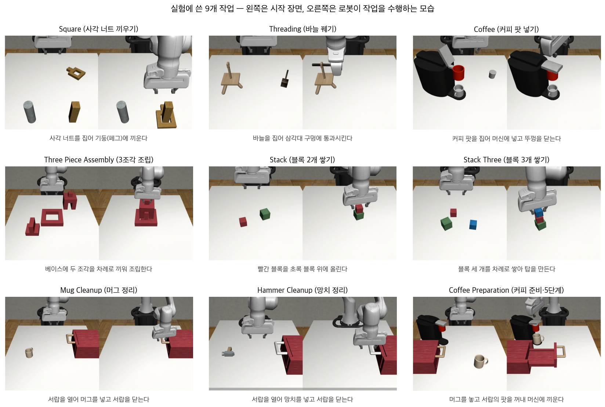
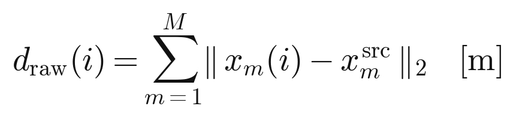
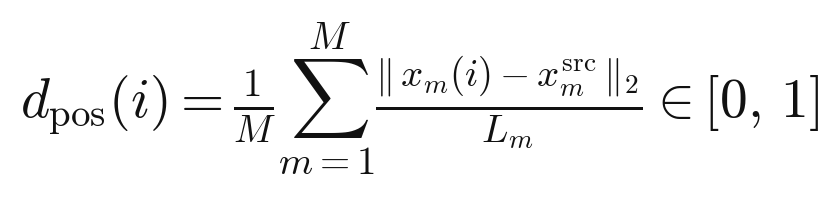
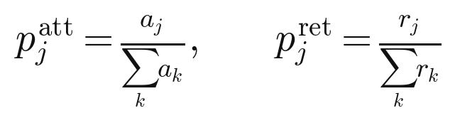
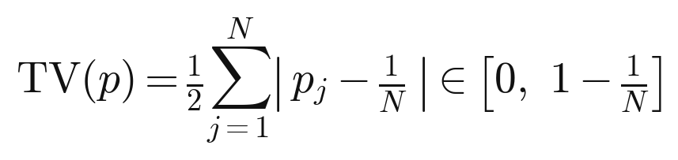
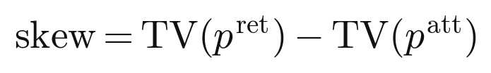
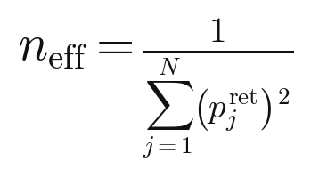
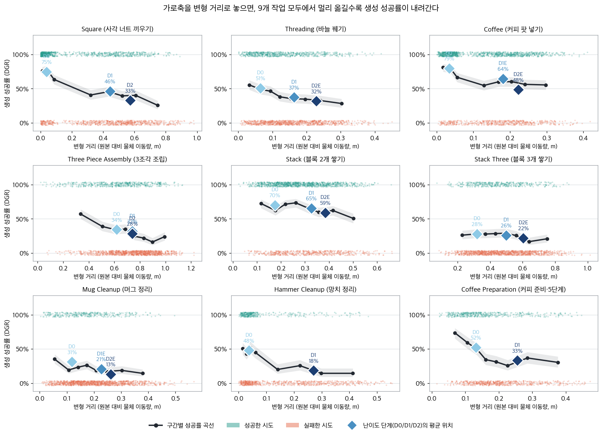
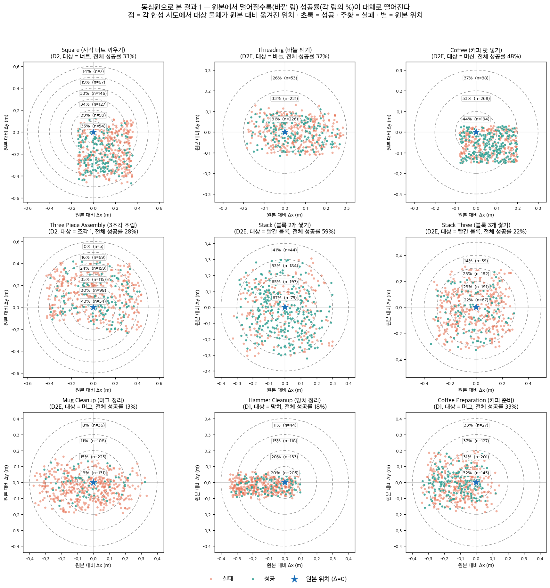
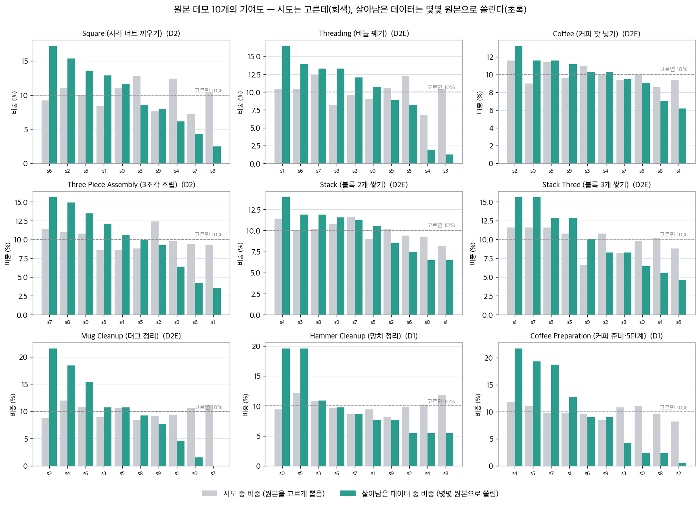

# Bias in Synthetic Data Generation - Motivation 실험 (2): Task 확장

## Recall

### 무엇을 하려는 연구인가

로봇에게 어떤 일을 시키려면, 사람이 직접 조종해서 보여준 시연(demonstration, 이하 데모)을 로봇이 따라 하도록 학습시킨다. 이것을 모방학습이라고 한다. 그런데 로봇이 실제로 마주하는 상황은 매번 조금씩 다르다. 집어야 할 물체가 테이블 위 어디에 놓여 있느냐에 따라 팔을 뻗는 방향도, 손목을 트는 각도도 다 달라진다. 그래서 데모 몇 개만으로는 부족하고, 물체 위치가 조금씩 다른 여러 상황을 담은 큰 데모 데이터셋이 필요하다.

사람이 그 많은 데모를 하나하나 다 만드는 건 비용이 크다. 그래서 사람 데모 몇 개를 자동으로 불려서 합성 데모를 대량으로 찍어내는 방법을 쓴다. 이 연구에서 다루는 **MimicGen**이 그 대표적인 방법이다.

### MimicGen이 합성 데모를 만드는 방식

MimicGen은 사람 데모 하나를 그대로 복사하는 게 아니라, 물체 위치가 다른 새 장면에 맞게 **변형해서** 다시 쓴다. 크게 세 단계다.

- **자르기** — 사람 데모를 "물체 하나를 다루는 구간" 단위로 쪼갠다(예: 너트를 집는 구간, 페그에 끼우는 구간). 이 구간을 subtask segment라고 부른다.
- **변형(transform)** — 새 장면에서 물체가 놓인 위치에 맞춰, 원본 구간의 로봇 손 궤적을 통째로 옮기고 돌린다. "원본에서 너트를 기준으로 이렇게 움직였다"는 상대적인 궤적은 그대로 두고, 새 너트 위치에 맞게 좌표만 바꾸는 것이다.
- **이어붙이고 성공한 것만 남기기(retain)** — 변형한 구간들을 매끄럽게 연결해서 시뮬레이터에서 실제로 실행해 보고, **작업에 성공한 것만** 데이터셋에 넣는다. 실패한 것은 버린다.

새 장면의 물체 위치는 미리 정해 둔 **초기 배치 영역(reset region)** 안에서 무작위로 뽑는다. 이 영역을 좁게 잡으면 원본 데모와 비슷한 위치들만 나오고, 넓게 잡으면 원본에서 멀리 떨어진 위치까지 나온다. MimicGen은 작업마다 좁은 영역부터 넓은 영역까지 몇 단계를 두는데, 관례적으로 **D0**(가장 좁음) → **D1** → **D2**(가장 넓음) 로 이름 붙인다.

### 이 연구가 의심하는 지점

문제는 마지막 단계, "성공한 것만 남기기"다. 이 방법이 잘 돌아가는지 재는 표준 지표는 **DGR**(data generation rate, 데이터 생성 성공률)이다. 생성을 시도한 횟수 중에서 성공해서 데이터셋에 남은 비율을 말한다(`DGR = 성공 수 / 시도 수`). 그런데 DGR은 "얼마나 자주 남는가"만 알려줄 뿐, **"무엇이 남는가"** 는 말해 주지 않는다. 만약 성공하기 쉬운 특정 조건의 데모만 살아남는다면, 최종 데이터셋은 원래 넓게 탐색했던 다양성을 잃어버린다. DGR이 똑같아도 이런 쏠림의 정도는 얼마든지 다를 수 있고, 그 쏠림은 결국 이 데이터로 학습한 로봇의 성능에 영향을 준다.

### 지난 실험에서 관찰한 것 (4개 작업)

지난 보고서에서는 MimicGen이 데모와 주석을 잘 제공하는 작업 4개(Square, Three Piece Assembly, Threading, Coffee)를 골라, 난이도 단계(D0/D1/D2)마다 합성 데모 생성을 500번씩 시도하고 성공·실패를 전부 기록해서 두 가지를 봤다.

- **관찰 1** — 원본 데모의 물체 배치와 합성 장면의 물체 배치가 멀수록, 즉 더 많이 옮겨서 변형해야 할수록 생성 성공률(DGR)이 낮아진다.
- **관찰 2 (원본 쏠림)** — 많이 옮겨야 하는 경우일수록, 성공해서 남는 합성 데모가 "잘 옮겨지는" 원본 데모 몇 개의 결과물로 쏠린다. MimicGen은 원본 궤적을 규칙대로 변형해 쓰므로, 이 쏠림은 로봇이 배우는 동작 궤적(action trajectory)의 다양성을 줄일 수 있다.

## 이번 실험의 질문

> 위의 두 관찰이 그 4개 작업에서만 우연히 나온 것인가, 아니면 성공한 것만 남기는 방식으로 데이터를 만드는 한 어느 작업에서나 나타나는 성질인가?

이번에는 작업을 9개로 늘려 같은 실험을 반복했다. **결론부터 말하면, 작업을 넓혀도 두 관찰이 그대로 유지된다.** 9개 작업 전부에서 초기 배치 영역을 넓힐수록 DGR이 떨어졌고(예외 없음), 성공해서 남기 어려운 작업일수록 원본 쏠림이 더 심했다.

## 이번 실험에서 다룬 9개 작업

먼저 어떤 작업들인지부터 본다. 아래 그림에서 각 칸의 왼쪽은 작업이 시작될 때의 장면, 오른쪽은 로봇 팔이 그 작업을 수행하는 모습이다.

작업마다 난이도 단계(초기 배치 영역이 좁은 것부터 넓은 것까지)를 아래처럼 뒀다.

| 작업 | 하는 일 | 난이도 단계 | 물체 수 | 비고 |
|---|---|---|---|---|
| Square | 사각 너트를 집어 페그에 끼움 | D0 → D1 → D2 | 2 | 공개 단계가 이미 넓히기형 |
| Threading | 바늘을 삼각대 구멍에 통과 | D0 → D1 → **D2E** | 2 | 공개 D2가 좌우 반전이라 넓히기판 신설 |
| Coffee | 커피 팟을 머신에 넣고 닫음 | D0 → **D1E** → **D2E** | 2 | 공개 D1·D2 모두 옮기기/반전이라 신설 |
| Three Piece Assembly | 베이스에 두 조각 조립 | D0 → D1 → D2 | 3 | 위치가 아니라 회전으로 넓어지는 작업 |
| Stack | 블록 2개 쌓기 | D0 → D1 → **D2E** | 2 | 공개는 D1까지라 한 단계 신설 |
| Stack Three | 블록 3개 쌓기 | D0 → D1 → **D2E** | 3 | 상동 |
| Mug Cleanup | 서랍에 머그를 넣고 닫음 | D0 → **D1E** → **D2E** | 2 | 공개 D1이 머그 영역을 옆으로 밀어 신설 |
| Hammer Cleanup | 서랍에 망치를 넣고 닫음 | D0 → D1 | 2 | 공개 2단 |
| Coffee Preparation | 머그 놓고 팟 꺼내 끼움 (5단계) | D0 → D1 | 3 | 공개 2단, 단계가 긴 작업 대표 |

굵은 글씨가 이번에 새로 정의한 넓히기 단계다(뒤의 "이번에 정비한 것"에서 설명한다). 모든 단계에서 시도 500번씩 고정, 성공·실패 전부 기록, 원본 데모는 각 작업의 공개본 10개를 그대로 썼다.

### 작업별 초기 배치 영역

각 작업의 초기 배치 영역을 위에서 내려다본 그림이다. 상자가 물체가 놓일 수 있는 영역이고(색 = 난이도 단계), 별표는 그 단계에서 고정된 물체다. 단계가 올라갈수록 상자가 이전 상자를 **감싸며 커지는 것**(옆으로 옮기는 게 아니라 넓히는 것)을 볼 수 있다.

Three Piece Assembly는 조금 다르게 읽어야 한다. 이 작업은 D0→D1에서 베이스가 고정에서 이동으로 풀리고, D1→D2에서는 위치는 그대로 둔 채 조각들의 회전만 풀린다. 그래서 위 그림에서는 위치 상자가 겹쳐 보인다. 넓어지는 축이 위치가 아니라 회전인 작업이다.

## 두 가지 지표의 정의

결과를 보기 전에, 이번 실험이 재는 두 값을 명확히 해 둔다.

### 지표 1 — 변형 거리 (transform distance)

**한 줄 정의**: 어떤 합성 시도에서, 각 물체가 원본 데모에서 놓였던 자리와 지금 합성 장면에서 놓인 자리가 얼마나 떨어져 있는지를 잰 값. 물체가 여럿이면 각 물체의 거리를 더한다.

한 합성 시도를 `i`라 하고, 그 시도가 원본 데모 `s(i)`를 변형해서 만들어졌다고 하자. 작업에 움직이는 물체가 `M`개 있고, 물체 `m`의 초기 위치가 원본에서는 `x_src(m)`, 이번 합성 장면에서는 `x(m,i)`라면, 변형 거리는 각 물체가 옮겨 간 직선거리의 합이다.

- **왜 이 값인가** — MimicGen은 원본 궤적을 새 물체 위치로 "옮겨서" 쓴다. 옮기는 거리가 멀수록 원본 궤적을 더 많이 비틀어야 하고, 그만큼 실행이 어긋나 실패하기 쉽다. 그래서 이 거리가 곧 "이 시도가 얼마나 많이 변형해야 하는가"의 척도가 된다.
- **어떻게 재는가** — 한 합성 시도가 시작될 때 각 물체의 초기 위치를 기록해 두면, 그 시도가 어느 원본에서 왔는지도 함께 기록되므로(뒤의 원본 쏠림 참조), 원본의 그 물체 위치와의 직선거리를 물체마다 계산해 더한다. 단위는 미터다. 예를 들어 Square에서 너트가 원본보다 20cm, 페그가 15cm 떨어진 곳에 놓였다면 이 시도의 변형 거리는 0.35m다.
- **작업끼리 비교할 때의 정규화** — 작업마다 물체 크기와 영역 크기가 다르므로, 여러 작업을 한 그림에 겹쳐 비교할 때는 각 물체의 거리를 그 물체가 놓일 수 있는 영역(가장 넓은 단계 기준)의 대각선 길이 `L_m`으로 나눠 평균한다.

  0은 원본과 같은 자리, 1은 그 영역에서 갈 수 있는 가장 먼 곳을 뜻한다. 한 작업 안에서의 경향만 볼 때는 미터 단위(`d_raw`)와 정규화 값(`d_pos`)이 사실상 같은 결과를 준다(9개 작업 모두에서 두 정의로 잰 거리-성공률 관계의 차이가 0.003 이하). 그래서 본문에서는 직관적인 미터 단위로 읽으면 된다.

난이도 단계 D0 → D1 → D2는 결국 "변형 거리 분포를 오른쪽으로(더 멀게) 미는" 조작이다. 좁은 D0에서는 물체가 원본 근처에만 놓여 변형 거리가 작고, 넓은 D2에서는 멀리까지 놓여 변형 거리가 커진다.

### 지표 2 — 원본 쏠림 (source skew)

**배경 개념**: 합성 데모 하나하나는 반드시 원본 데모 10개 중 **어느 하나**를 변형해서 만든 것이다. 그 "출신" 원본을 이 데모의 source라고 부르자. MimicGen은 매 시도마다 원본을 무작위로 고르므로, **시도 단계에서는** 원본 10개가 거의 고르게 쓰인다(각각 약 10%). 문제는 성공해서 **살아남은** 데모들이 어느 원본 출신이냐다. 특정 원본이 유난히 잘 성공한다면, 최종 데이터셋은 그 몇 개 원본의 결과물로 채워진다.

**한 줄 정의**: 살아남은 데모가 원본 10개에 고르게 퍼져 있는지, 아니면 몇 개로 몰려 있는지를, 시도 단계와 견줘서 얼마나 더 몰렸는지로 잰 값.

원본이 `N=10`개라 하자. 시도 단계에서 원본 `j`가 쓰인 횟수를 `a_j`, 그중 성공해 살아남은 횟수를 `r_j`라 하고, 각 단계의 점유 비율을 이렇게 둔다.

몰린 정도는 **total-variation 거리(TV)** 로 잰다. 어떤 비율 분포 `p`가 완전히 고른 분포(각 원본 `1/N`)와 얼마나 다른지를 재는 표준적인 값으로, "몇 %의 데모를 다른 원본 몫으로 옮겨야 딱 고르게 되는가"로 읽으면 된다.

원본 쏠림은 살아남은 데모의 TV에서 시도 단계의 TV를 뺀, **성공한 것만 남기는 과정에서 새로 생긴 몫**으로 정의한다.

- **어떻게 읽나** — 0이면 살아남은 데모가 원본 10개에 완전히 고르게 퍼진 것이고, 클수록 몇 개 원본으로 몰린 것이다(최대 `1 - 1/N = 0.9`). 고르냐 몰렸냐를 재는 표준 거리라 "상위 몇 개" 같은 임의로 고른 기준이 필요 없다. 시도 단계의 TV를 빼 주는 이유는, 무작위로 골라도 우연히 생기는 약간의 불균형을 기준선으로 상쇄하고 **성공-필터링이 추가로 만든 쏠림만** 보기 위해서다. 실제로 시도 단계의 TV는 9개 작업 모두에서 0.04~0.07로 작아서(무작위 선택이 잘 작동해 시도는 고르다는 확인이다), skew는 사실상 살아남은 데모가 몰린 정도 그 자체다.
- **함께 보는 값: 실질 원본 수 (`n_eff`)** — 살아남은 데모가 실질적으로 원본 몇 개에서 나온 셈인지를 하나의 숫자로 요약한 것으로, 역-심슨 지수로 정의한다.

  완전히 고르면 `n_eff = 10`, 한 원본에 다 몰리면 1이다. 예를 들어 뒤에 나오는 Mug Cleanup의 가장 넓은 단계에서는 `n_eff = 6.9`로, 원본 10개 중 실질적으로 7개 정도만 데이터에 기여한 셈이다.
- **왜 중요한가** — 이 쏠림은 "어떤 물체 위치가 데이터에 많고 적은가"(초기 위치의 편향)와는 다른, 한 겹 더 깊은 편향이다. 출신 원본이 몰린다는 건 곧 그 몇 개 원본의 **움직이는 방식**이 데이터를 지배한다는 뜻이고, 로봇이 배우는 동작의 다양성이 좁아질 수 있다.

## 이번에 정비한 것 두 가지

작업을 늘리기 전에, 지난 실험에서 걸렸던 문제 두 가지를 먼저 정리했다.

**첫째, "영역 넓히기"와 "영역 옮기기"를 갈라놓았다.** MimicGen이 공개한 난이도 단계 중 일부는 영역을 넓히는 게 아니라 물체를 테이블 반대편으로 **옮겨 버린다**(예: 공개된 Threading D2는 바늘과 삼각대의 좌우를 통째로 뒤집는다). 이러면 "원본에서 멀어져서 어려운 것"과 "아예 처음 보는 영역이라 어려운 것"이 섞여서 해석이 오염된다. 그래서 이런 작업에는 **이전 단계 영역을 그대로 품으면서 넓히기만 하는 단계**를 새로 정의하고 이름 끝에 E를 붙였다(D1E, D2E). 넓힐 수 있는 한계는 감이 아니라 실측으로 정했다. 후보 영역의 극단 위치(모서리 네 곳, 집는 물체는 변 중앙 네 곳 추가)에 물체를 고정하고 각 50번씩 생성을 시도해서, "로봇 손이 물체에 닿아 첫 단계를 끝내는 비율"이 영역 안쪽과 비슷할 때만 그 경계를 확정했다. 이 검사에서 실제로 두 군데가 걸렸다(Coffee는 두 물체 영역이 중앙에서 마주 보는 안쪽 모서리에서 팔 진로가 막혔고, Stack은 로봇 팔이 닿는 한계인 먼 모서리였다). 규칙대로 해당 경계를 2cm씩 줄여 통과시켰다.

**둘째, 생성 설정을 모든 작업에서 똑같이 맞췄다.** 원본 데모를 무작위로 고르도록, 그리고 한 합성 데모에는 원본 하나만 쓰도록 고정했다. 일부 작업의 공개 설정은 지금 장면과 가장 비슷한 원본을 골라 주는데, 그러면 시도 자체가 원본 근처로 쏠려서 변형 거리와 출신 원본이 하나로 정해지지 않기 때문이다. 이 변경의 영향은 Square에서 확인했다. 무작위 선택으로 다시 돌린 DGR 21.0%는 MimicGen 논문의 같은 조건 값 22.4%와 잘 맞았다.

## 결과 1 — 옮기는 거리가 멀수록 생성 성공률이 떨어진다 (9/9 작업)

아래 그림은 각 작업에서 가로축을 **변형 거리**(원본 대비 물체를 얼마나 옮겼는가, 미터)로 놓고, 세로축을 그 거리 구간에서의 생성 성공률(DGR)로 그린 것이다. 검은 선이 거리 구간별 성공률, 위쪽 초록 점·아래쪽 주황 점은 개별 시도(성공/실패), 파란 마름모는 난이도 단계(D0/D1/D2)가 각각 평균적으로 어디쯤 놓이는지를 표시한 것이다.

- **9개 작업 전부에서 오른쪽으로 갈수록 내려간다, 예외 없음** — 초기 배치 영역을 순수하게 넓히기만 해도(반대편으로 옮기지 않고) 생성 성공률이 한 번도 반등하지 않고 떨어진다. 난이도 단계 D0/D1/D2는 결국 이 한 곡선 위에서 왼쪽(가까움)부터 오른쪽(멂)으로 놓인 표본일 뿐이라는 게 파란 마름모로 보인다. 지난 실험의 관찰 1이 특정 작업의 우연이 아니라, 성공한 것만 남기는 생성 방식이면 어디서나 나타나는 성질임을 보여 준다.
- **내려가는 폭은 작업마다 다르다** — 블록을 쌓기만 하면 되는 Stack은 완만하고(70→59%), 정밀하게 끼우거나 서랍 여닫기까지 얹힌 작업은 가파르다(Hammer Cleanup 48→18%, Mug Cleanup 31→13%). 이 폭의 차이가 뒤의 결과 2에서 열쇠가 된다.
- **Three Piece Assembly만 완만해 보이는 이유** — 이 작업은 D1→D2에서 물체 위치는 그대로 두고 회전만 넓히기 때문에, 가로축(위치 이동량)에서는 D1과 D2가 거의 같은 지점에 겹친다. 그래도 성공률은 32→28%로 내려가는데, 이건 위치가 아니라 회전이 만든 하락이다.

### 같은 결과를 동심원으로

결과 1을 위치 지도로도 그렸다. 각 점은 하나의 합성 시도이고, 점의 위치는 그 작업에서 가장 많이 옮겨지는 물체가 원본 위치(가운데 별, Δ=0)에서 어느 방향으로 얼마나 벗어났는지를 미터 단위로 나타낸다. 초록은 성공, 주황은 실패다. 점선 동심원은 원본에서의 거리(0.1m 간격)이고, 원 옆의 숫자는 그 거리 구간의 생성 성공률(과 그 구간에 든 시도 수)이다.

- **안쪽 원은 초록, 바깥 원으로 갈수록 주황** — 링에 적힌 성공률이 바깥으로 갈수록 내려간다(Stack 67 → 65 → 53 → 41%, Square 안쪽 33~39%대에서 바깥 19 → 14%, Mug Cleanup 13 → 11 → 8%, Hammer Cleanup 20 → 15 → 11%). 결과 1의 곡선을 위에서 내려다본 그림인 셈이다.
- **Coffee 계열은 예외적으로 완만하다** — Coffee와 Coffee Preparation은 링별 성공률이 거의 평평하다. 이 두 작업은 난이도가 물체의 좌우 위치보다 커피 머신의 회전과 여러 단계 수행에서 오기 때문이다. 앞서 Three Piece Assembly가 위치가 아니라 회전으로 넓어졌던 것과 같은 맥락으로, 위치만 그린 이 지도에서는 잘 드러나지 않는다.

## 결과 2 — 성공이 드문 작업일수록 몇몇 원본으로 더 쏠린다

아래는 각 작업의 가장 넓은 단계에서, 원본 데모 10개가 각각 (a) 시도에서 차지한 비중(회색)과 (b) 살아남은 데이터에서 차지한 비중(초록)을 나란히 놓은 것이다. 회색은 거의 10% 선에 붙어 고른데(무작위로 고르니 당연하다), 초록은 왼쪽이 높고 오른쪽이 뚝 떨어지는 계단 모양이다. 즉 몇몇 원본이 살아남은 데이터를 많이 차지하고, 꼬리 쪽 원본은 거의 기여하지 못한다.

이 쏠림의 크기를 작업끼리 비교한 것이 아래 그림이다. 가로축은 원본 쏠림 값(살아남은 데모가 몰린 정도 − 시도 단계에서 몰린 정도, TV 기준)이다. 회색 점이 가장 좁은 단계(D0), 파란 점이 가장 넓은 단계이고, 화살표 길이가 "영역을 넓혔을 때 쏠림이 얼마나 더 커졌는가"다.

- **영역을 넓히면 쏠림이 커진다** — 이번에 추가한 작업들에서 특히 뚜렷하다. Coffee Preparation은 0.17 → 0.28, Mug Cleanup은 0.11 → 0.22, Hammer Cleanup은 0.00 → 0.15로 벌어진다.
- **성공률이 높은 작업에서는 쏠림이 거의 없다** — Stack(0.07)이나 Coffee(0.04)처럼 성공률이 높은 작업은 어중간한 원본에서 나온 시도도 곧잘 성공하므로, 살아남은 데이터가 원본 10개에 고르게 퍼진다. 성공이 드물어 탈락이 많은 작업에서만 원본 사이의 성공률 차이가 데이터에 그대로 드러난다. 결과 1에서 성공률이 많이 떨어진 작업이 결과 2에서 더 많이 쏠린다 — 두 결과가 같은 방향으로 움직인다.
- (Stack Three나 Three Piece처럼 D0에서도 이미 성공률이 낮은 작업은, 좁은 단계에서부터 이미 몇몇 원본으로 쏠려 있어서 넓혀도 화살표가 짧거나 거의 제자리다. 처음부터 탈락이 많기 때문이다.)

가장 심한 Mug Cleanup의 가장 넓은 단계(D2E)를 예로 보자. 시도는 원본별로 42~60회로 고른데, **살아남은 65개가 어느 원본 출신이냐를 보면 크게 쏠려 있어서, 원본 10개 중 2개는 살아남은 데이터를 거의 또는 전혀 못 남겼다**(s7은 56번 시도해 생존 0개, s0은 53번에 1개). 실질 원본 수로 환산하면 좁은 D0에서 8.5개였던 것이 D2E에서 6.9개로 줄어, 원본 10개 중 실질적으로 7개 정도만 데이터에 기여한 셈이다(쏠림 값으로는 0.11 → 0.22).

| 원본 (Src) | 시도 (Attempted) | 생존 (Retained) | 성공률 | 살아남은 데이터 중 비중 |
|---|---|---|---|---|
| s2 | 44 | 14 | 32% | 22% |
| s4 | 60 | 12 | 20% | 18% |
| s6 | 54 | 10 | 19% | 15% |
| s3 | 45 | 7 | 16% | 11% |
| s8 | 42 | 6 | 14% | 9% |
| s5 | 53 | 7 | 13% | 11% |
| s9 | 46 | 5 | 11% | 8% |
| s1 | 47 | 3 | 6% | 5% |
| s0 | 53 | 1 | 2% | 2% |
| s7 | 56 | 0 | 0% | **0%** |

## 참고 — 공개된 "옮기기" 단계는 어떻게 확인됐나

지난 보고서에서 "일부 작업은 분포가 좌우 반전이라 거리-성공률 경향이 잘 안 보인다"고 판단했는데, 이번에 그 판단을 수치로 확인했다. 두 영역을 합친 상자로 변형 거리를 다시 정규화해 보면, 옮기기 단계의 물체 배치는 넓히기 단계의 거리 범위와 **아예 겹치지 않는, 모든 원본에서 순수하게 더 먼 구간**을 차지한다(Threading의 경우 넓히기는 정규화 거리 0.37 이하, 옮기기는 0.48 이상). 넓히기 쪽의 거리-성공률 추세를 그 먼 구간까지 연장해서 비교하면, Threading(위치만 반전)은 실측과 잘 맞고(예측 24.1% vs 실측 22.0%), Coffee(머신이 놓인 방향까지 약 180° 뒤집힘)는 실측이 예측보다 27.9%p 낮다. 즉 위치를 얼마나 옮겼는가가 난이도의 1차 설명이되, 방향까지 뒤집는 것은 그 위에 얹히는 별도의 난이도라는 부수 확인이다. 이번 실험의 넓히기 단계는 이런 옮기기·반전을 배제했으므로, 결과 1의 거리-성공률 관계가 오염 없이 나왔다.

## Takeaway & Next Step

**Takeaway:**

- **두 관찰이 일반화됐다** — "옮기는 거리가 멀수록 생성 성공률이 떨어진다"(9/9 작업, 예외 없음)와 "성공이 드문 작업일수록 살아남은 데이터가 몇몇 원본으로 쏠린다"(쏠림 값 최대 0.28)가, 작업 4개에서 9개로 늘려도 그대로 유지된다. 4개 작업의 우연이 아니라, 성공한 것만 남기는 생성 방식이면 어디서나 나타나는 성질로 볼 근거가 생겼다.
- **쏠림의 크기가 처음으로 스펙트럼으로 잡혔다** — "거의 0인 작업"(Stack, Coffee)부터 "실질 원본의 3분의 1이 사라지는 작업"(Mug Cleanup, Coffee Preparation)까지. 생성 성공률이 낮은 작업일수록 쏠림이 크므로, 앞으로 어떤 작업에서 이 편향을 걱정해야 하는지 미리 가늠할 단서가 된다.

**Next Step:** 그렇다면 이 쏠림이 정말 로봇의 최종 성능(policy 성능)을 떨어뜨리는가? 이를 확인하는 정책 실험이 이미 돌아가고 있다.

- 4개 작업의 가장 넓은 단계에서 시도 6,250번짜리 큰 풀을 만든다(성공·실패 전부 기록).
- 같은 풀에서 학습용 데이터셋 세 벌을 500개씩 뽑는다 — ① 그냥 무작위 500개(표준 파이프라인), ② 원본과의 변형 거리 구간별로 고르게 뽑은 500개, ③ 출신 원본이 고르게 되도록 뽑은 500개. 같은 풀에서 뽑으므로 셋의 차이는 오직 "어떤 500개를 남겼나"뿐이다.
- 세 데이터셋을 똑같은 학습 레시피(MimicGen 논문의 BC-RNN 설정 그대로)로 학습하고, 미리 고정해 둔 200개 시작 상태에서 똑같이 평가해 짝지어 비교한다. 거리 구간을 고르게 채운 ②가 원본에서 먼 시작 상태에서 ①보다 잘한다면, 성공한 것만 남기는 과정이 만든 쏠림이 로봇 성능을 떨어뜨린다는 인과적 근거가 된다. ③과의 비교로는 그 원인이 변형 거리 쪽 쏠림 때문인지 출신 원본 쪽 쏠림 때문인지를 갈라 볼 수 있다.
