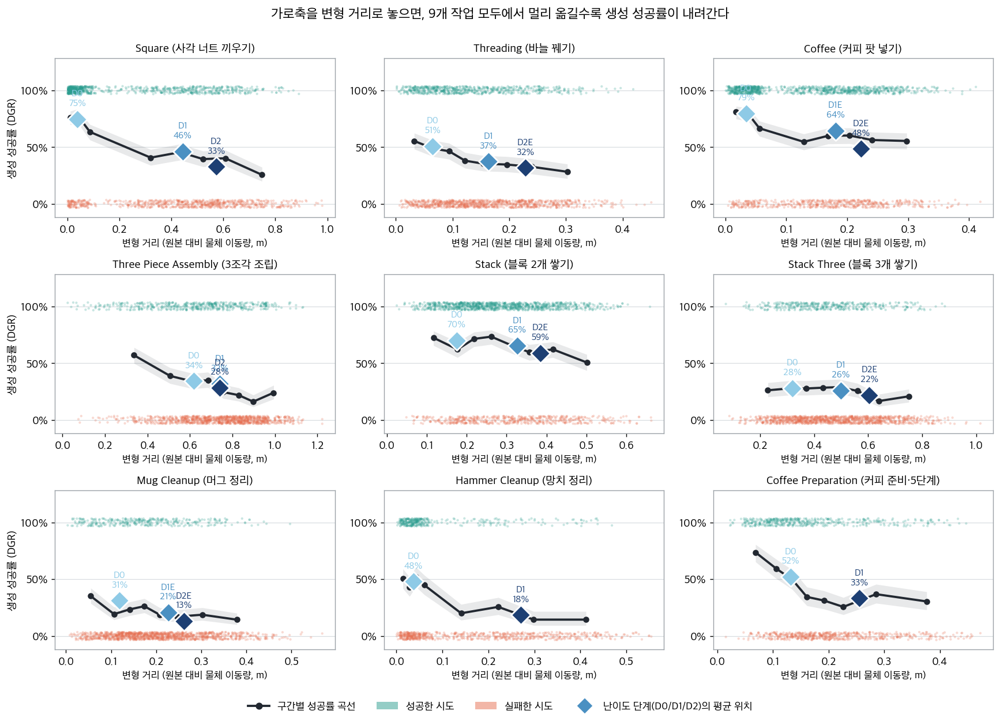
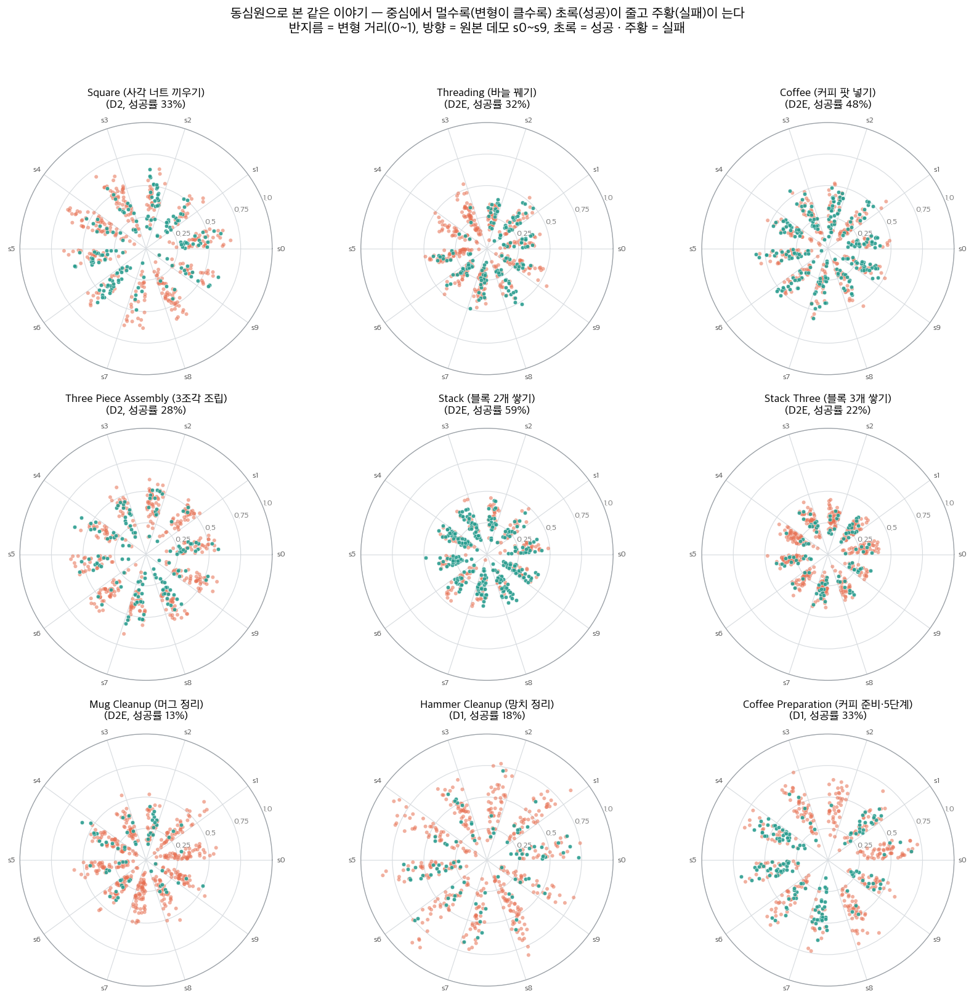
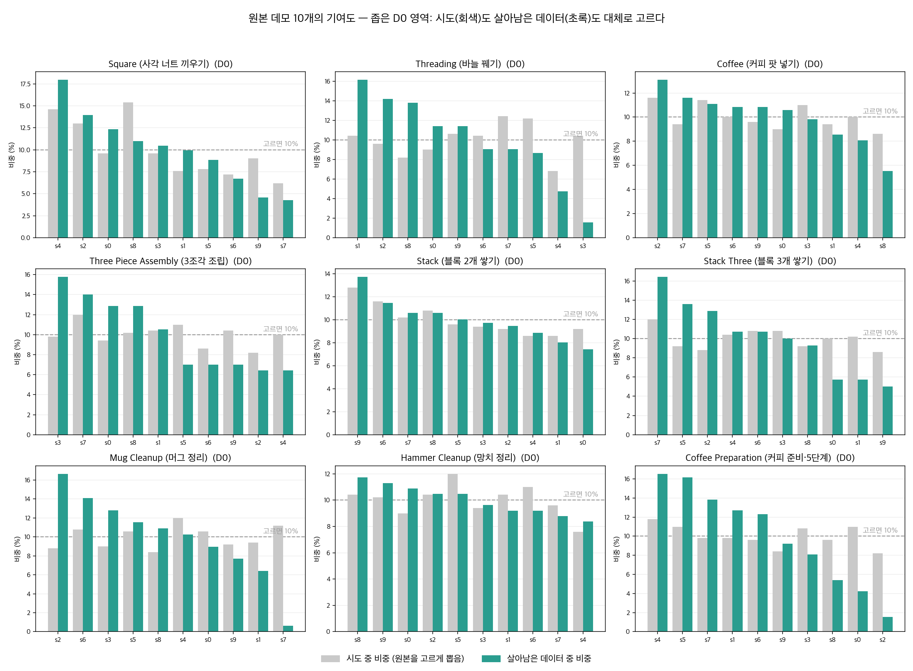
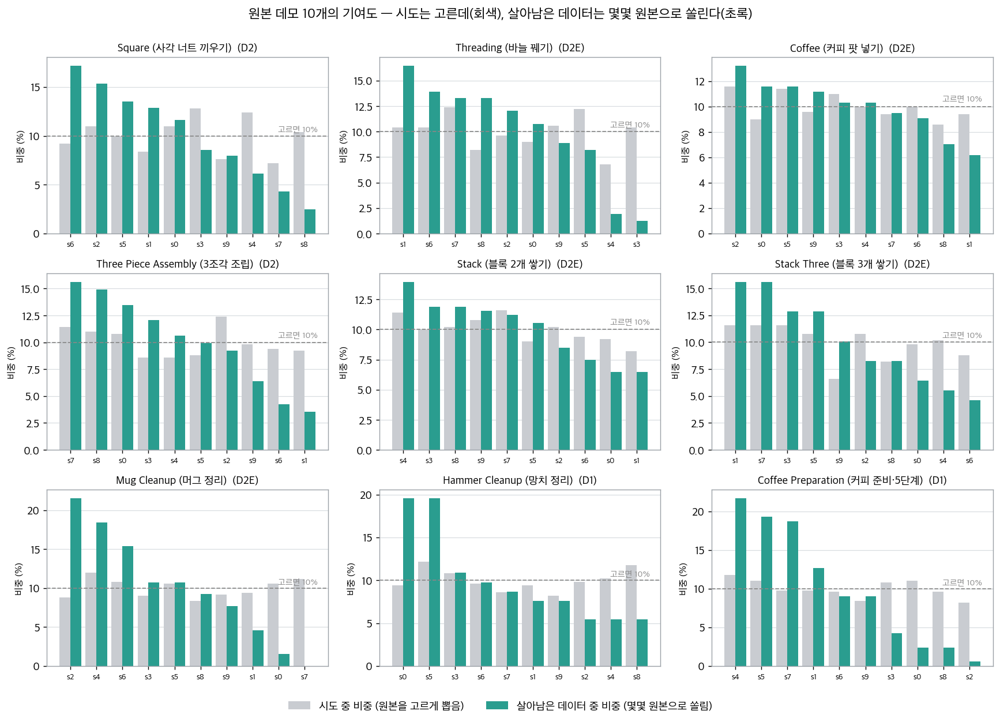
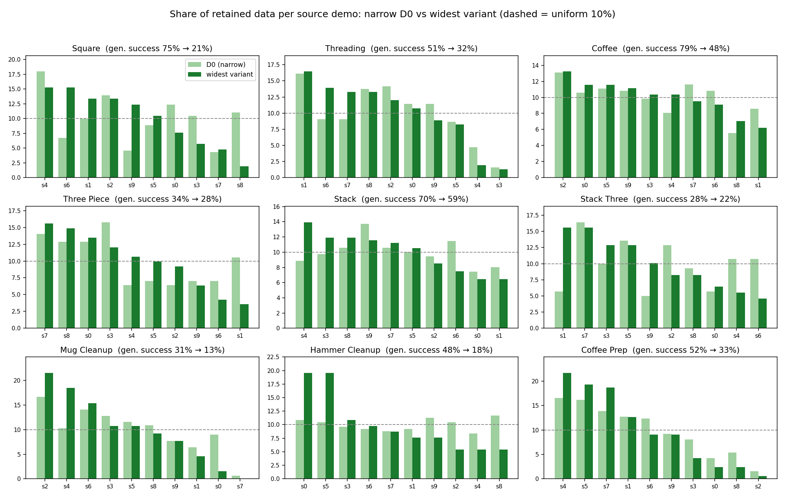
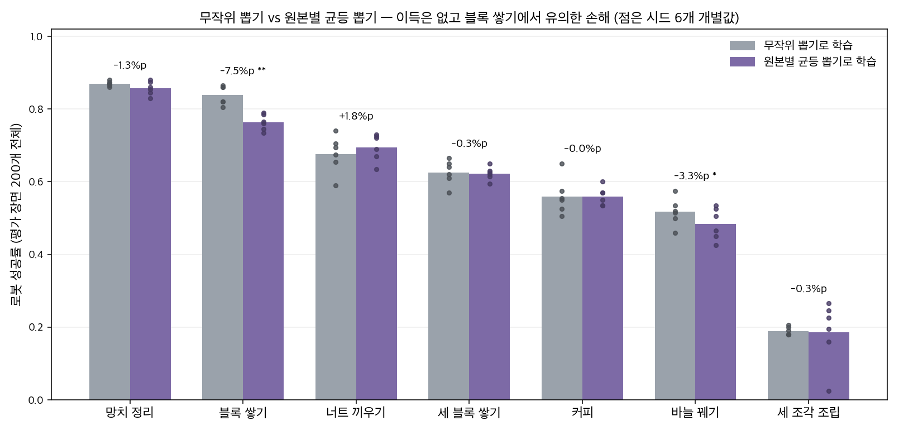
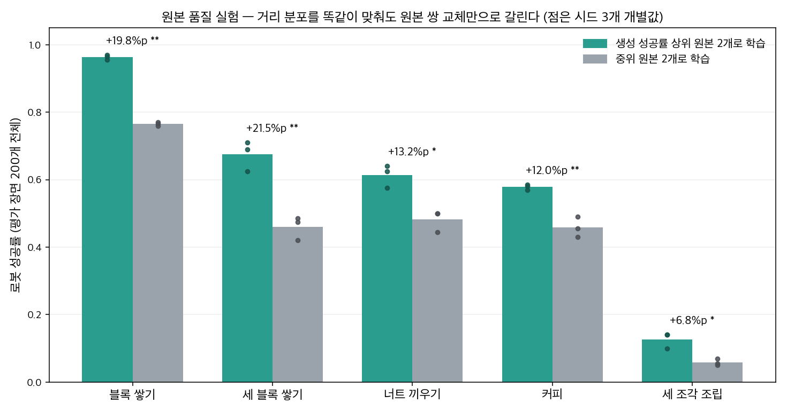
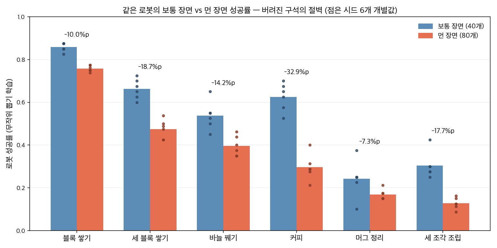
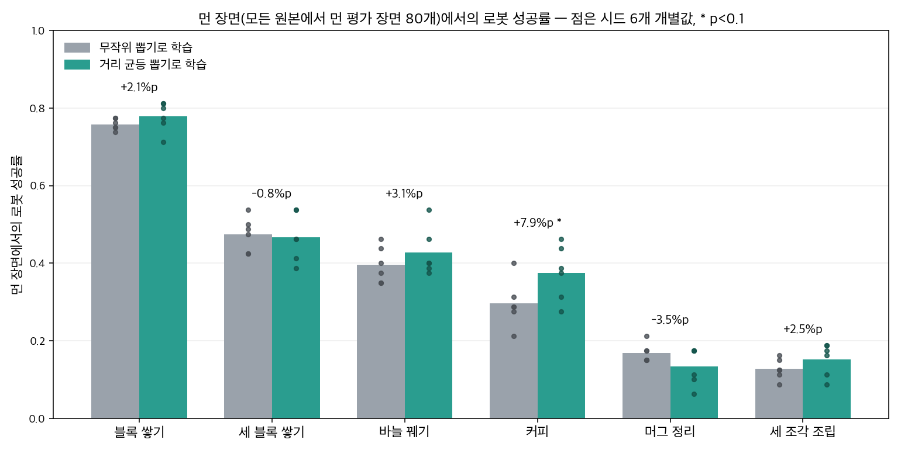

# 성공한 데모만 남기는 방식은 로봇을 해치는가

2026-07-17 \~ 08-04. 이 문서 하나만 앞에서부터 읽으면 우리가 무슨 질문을 왜 던졌고, 어떻게 실험했고, 무엇이 확실하고, 무엇이 아직 열려 있는지 전부 따라올 수 있게 썼다.

---

## 1. 배경: 로봇을 가르치는 데이터가 왜 문제인가

로봇에게 "블록을 쌓아라" 같은 일을 시키는 흔한 방법은 모방학습이다. 사람이 로봇 팔을 직접 조종해 시범을 보여주면, 로봇이 그 시범들을 흉내 내도록 신경망을 학습시킨다. 그런데 물체가 놓이는 위치는 매번 조금씩 다르므로, 위치가 다른 온갖 상황을 담은 시범이 수백 개 필요하다. 사람이 다 만들기에는 비용이 너무 크다.

그래서 시범을 자동으로 불리는 도구가 나왔고, 우리가 연구하는 **MimicGen**이 대표적이다. 작동 방식은 세 단계다. 사람이 만든 시범 10개를 받는다. 물체를 새 위치에 놓은 장면을 만들고, 사람 시범의 팔 궤적을 새 위치에 맞게 옮겨 심어 시뮬레이터에서 실행해 본다. **성공하면 데이터셋에 넣고, 실패하면 버린다.** 이 마지막 단계를 이 문서에서는 **성공 필터**라고 부르겠다.

## 2. 용어

이 문서에서 반복해서 쓸 말들을 여기서 한 번에 정의한다. 이후 본문은 이 용어만 쓴다.

| 용어 | 뜻 |
|---|---|
| **원본** | 사람이 직접 만든 시범. 작업마다 10개가 있다 |
| **합성 데모** | 원본의 팔 궤적을 새 물체 배치에 옮겨 심어 만든 시범. 로봇 학습에 쓰는 재료 |
| **풀** | 합성 데모 생성을 수천 번 시도하고 성공·실패를 전부 기록해 둔 묶음. 학습용 데이터는 여기서 골라낸다 |
| **생성 성공률** | 생성 시도 중 성공해서 데이터가 된 비율. "원본 A의 생성 성공률"이라고 하면, 원본 A를 옮겨 심은 시도 중 성공한 비율 |
| **로봇 성공률** | 학습을 마친 로봇을 고정된 평가 장면들에서 돌렸을 때 작업을 완수한 비율 |
| **거리** | 어떤 물체 배치가 원본의 배치와 얼마나 다른가. 물체마다 이동한 직선거리를 재고, 각 물체가 이동할 수 있는 최대 거리로 나눠서(물체끼리 단위를 맞추기 위해), 평균낸 값. 0이면 원본과 같은 배치, 1이면 가능한 가장 다른 배치 |
| **가까운 데모 / 먼 데모** | 자기 원본과의 거리가 작은 / 큰 합성 데모 |
| **먼 장면** | 평가 장면 가운데, 원본 10개 중 가장 비슷한 것을 골라도 거리가 큰 장면. "베낄 원본이 하나도 없는 상황" |
| **거리 균등 뽑기** | 학습용 500개를 거리 다섯 구간에서 100개씩 뽑아, 학습 데이터의 거리 분포를 일부러 평평하게 만드는 규칙 |
| **원본별 균등 뽑기** | 학습용 500개를 원본 10개 출신별로 같은 수씩 뽑는 규칙 |
| **받는 쪽 물체** | 동작의 목적지가 되는 물체. 커피 팟을 꽂는 커피 머신, 바늘을 통과시키는 삼각대, 블록을 얹는 받침 블록. 반대는 집는 쪽 물체(팟, 바늘, 위 블록) |

## 3. 질문: 성공 필터가 남긴 데이터는 안전한가

성공 필터는 데이터를 두 방향으로 쏠리게 만든다. 첫째, 거리가 먼 시도일수록 옮겨 심은 궤적이 자주 실패하므로, 살아남은 합성 데모는 **가까운 데모 위주**가 된다. 이것을 **거리 쏠림**이라고 부르겠다. 둘째, 원본 10개 중에도 옮겨 심었을 때 잘 성공하는 것(생성 성공률이 높은 원본)과 아닌 것이 있어서, 살아남은 데이터가 **소수의 원본 출신으로 몰린다**. 이것은 **원본 쏠림**이다. 쏠림의 존재 자체는 MimicGen 저자들도 논문 6.3절에서 보고했다 — 어떤 작업에서는 데이터 1000개 중 850개가 원본 3개에서 나왔다.

우리의 질문은 그 다음이다. **이 두 쏠림이 로봇 성공률을 떨어뜨리는가? 떨어뜨린다면, 쏠림을 없앤 학습 데이터를 만드는 것(거리 균등 뽑기, 원본별 균등 뽑기)이 올바른 처방인가?** 장기 목표도 여기서 나온다. 우리는 풀의 기록만 보고 "이 데이터셋의 어떤 쏠림이 위험한지"를 진단하는 도구를 만들려 하는데, 그 도구가 무엇을 재야 하는지 정하려면 먼저 어떤 쏠림이 실제로 해로운지 알아야 한다.

## 4. 실험 방법: 공정한 비교를 어떻게 만들었나

모든 학습 실험은 같은 뼈대를 쓴다. 작업 8개(블록 쌓기, 커피, 바늘 꿰기, 너트 끼우기, 서랍 정리 등)마다 풀을 만들어 두고, 비교하고 싶은 조건들은 **같은 풀에서 학습용 500개를 골라내는 규칙만 바꿔서** 만든다. 생성 과정, 시뮬레이터, 원본, 학습 방법이 전부 동일하므로, 조건 사이에 남는 차이는 "어떤 500개를 남겼는가"뿐이다. 평가는 미리 고정해 둔 200개의 평가 장면에서 모든 조건을 똑같이 돌려 로봇 성공률을 비교한다. 같은 장면을 모든 조건이 공유하므로 장면 하나하나를 짝지어 비교할 수 있다. 우연에 속지 않도록, 같은 조건을 시드(어떤 500개를 뽑았는지와 신경망의 초기값)를 6번 바꿔 반복했다.

평가 장면 200개는 성공 필터를 거친 데이터에서 뽑지 않고, **배치 영역 안에서 물체 위치를 골고루 무작위로 뽑아** 만들었다. 즉 평가는 필터의 쏠림과 무관한, 로봇이 실제로 마주칠 상황의 분포다. 이 설계에도 빈틈이 하나 있는데 8절에서 다룬다.

### 무엇을 고정하고 무엇만 바꿨나

한 축을 검사할 때 다른 축이 따라 움직이면 결과를 해석할 수 없다. 예를 들어 "거리 구성을 바꿨더니 로봇 성공률이 변했다"고 말하려면, 그 사이 원본 구성이 몰래 바뀌지 않았어야 한다. 실험마다 무엇을 고정했는지 밝힌다.

| 실험 | 바꾼 것 | 고정한 것 |
|---|---|---|
| 뽑기 규칙 3종 비교 (8작업) | 규칙: 무작위 / 거리 균등 뽑기 / 원본별 균등 뽑기 | 풀, 500개라는 크기, 학습 방법. 규칙만 바꾸면 다른 축이 따라 움직일 수 있으므로, 실험 후 실측으로 확인했다 — 원본별 균등 뽑기의 거리 분포는 무작위와 사실상 같았다(평균 거리 차이 0.005 이하). 즉 원본별 균등 뽑기에서 생긴 성능 차이는 거리 탓이 아니다 |
| 거리 비율 실험 (4작업) | 가까운 데모와 먼 데모의 비율을 3:1에서 1:3으로 | **원본 2개를 동일하게 고정, 데모 수 500개 고정.** 거리를 바꿀 때 원본 구성이 못 움직이게 설계 |
| 먼 데모 유무 실험 (4작업) | 먼 데모를 학습에 넣는가 빼는가 | **원본 동일, 데모 수 400개 동일** |
| 원본 품질 실험 (5작업) | 원본 쌍 교체: 생성 성공률 상위 2개 ↔ 중위 2개 | **거리 분포를 다섯 구간 단위로 양쪽 똑같게 맞춤, 데모 수 동일.** 원본을 바꿀 때 거리 구성이 못 움직이게 설계 |
| 대리 지표 실험 (4작업) | 원본 쌍 교체: 생성 성공률 평균이 같은 두 쌍 | **생성 성공률 맞춤 + 거리 분포 맞춤 + 데모 수 동일** |

정리하면 — 거리를 실험할 때는 원본 구성을 고정했고, 원본을 실험할 때는 거리 분포를 고정했다. 처음의 3종 비교만은 설계 단계에서 고정하지 못했고, 대신 실험 뒤 실측으로 교란이 없었음을 확인했다.

### 결론을 세 차례 따져 물었다

결론을 굳히기 전에, **일부러 반대 입장에 서서 결점만 찾는 검증**을 세 차례 따로 진행했다. 1차는 통계가 올바른가(비교 단위, 반복 횟수), 2차는 놓친 해로움이 없는가, 3차는 "전부 무해하다는 결론 자체가 수상하지 않은가"라는 관점에 MimicGen 논문 재정독을 더했다. 3차에서 우리 판단 두 개가 실제로 뒤집혔다(7절).

## 5. 확실한 것 — 세 차례 검증을 통과한 결론

**첫째, 쏠림은 실재하고 특정 작업의 우연이 아니다.** 배치 영역을 넓힐수록 **생성 성공률**이 9개 작업 전부에서 떨어졌고, 원본 쏠림이 심한 작업에서는 원본 하나가 데이터에서 통째로 사라졌다(생성을 56번 시도해서 성공 0개). 이 항목의 수치는 전부 생성 단계의 것으로, 로봇 학습과는 아직 무관하다.

아래 첫 그림에서 가로축은 거리, 세로축은 생성 성공률이다 — 9개 작업 모두 오른쪽으로 갈수록 내려간다. 둘째 그림은 살아남은 데이터에서 원본 10개가 각각 차지한 비중을, 좁은 배치 영역(D0, 연한 초록)과 가장 넓은 배치 영역(진한 초록)에서 비교한 것이다. 점선이 완전 균등(10%)이다 — 좁을 때는 대체로 점선 근처에 있다가, 영역을 넓히면 몇몇 원본으로 몰리고 꼬리 원본은 거의 사라진다(예: 망치 정리의 s0·s5는 10%에서 20%로, 커피 준비의 하위 4개 원본은 합쳐서 10% 아래로).

같은 내용을 위에서 내려다본 그림도 있다. 점 하나가 생성 시도 하나이고, 점의 위치는 그 작업에서 가장 많이 옮겨지는 물체가 원본 위치(가운데 별)에서 어느 방향으로 얼마나 벗어났는지다. 초록이 성공, 주황이 실패이며, 점선 동심원 옆 숫자는 그 거리 구간의 생성 성공률이다 — 안쪽 원은 초록이 우세하고 바깥으로 갈수록 주황이 늘어난다.

원본 쏠림은 아래 두 그림을 위아래로 비교하면 보인다. 형식은 같다 — 회색 막대가 생성 시도에서 각 원본이 쓰인 비중(고르게 뽑으므로 10% 근처), 초록 막대가 살아남은 데이터에서 차지한 비중이다. 위 그림(좁은 D0 영역)에서는 초록도 대체로 10% 선 근처에 있지만, 아래 그림(가장 넓은 영역)에서는 초록이 몇몇 원본으로 몰리고 꼬리 원본은 거의 사라진다.

같은 비교를 한 장으로 압축한 그림도 있다 — 원본마다 살아남은 데이터 비중을 좁은 D0(연한 초록)와 최광 변형(진한 초록) 막대로 나란히 놓은 것이다. 제목의 화살표는 그 작업의 생성 성공률이 영역 확장으로 얼마나 떨어졌는지다.

**둘째, 거리 균등 뽑기는 효과가 없다.** 8개 작업, 짝지은 비교 9,600건에서 무작위 뽑기와 차이가 없었다. 반복이 2번뿐이던 초기에는 나아 보였지만 6번으로 늘리자 차이가 전부 사라졌다 — 적은 반복이 만든 착시였다. "균등 뽑기가 실제로는 아무것도 안 바꿔서 차이가 없었던 것 아닌가"도 확인했다. 거리 균등 뽑기는 먼 데모의 비중을 실제로 최대 13%포인트 끌어올린, 내용이 있는 조작이었다. 원본을 고정한 거리 비율 실험에서도 3:1을 1:3으로 뒤집는 큰 조작이 블록 쌓기에서 차이를 만들지 못했다. MimicGen 논문에 실린 저자들의 자체 비교 실험도 같은 방향을 가리킨다.

아래 표의 수치는 전부 **로봇 성공률**(시드 6번 평균)이다.

| 작업 | 무작위 뽑기로 학습 | 거리 균등 뽑기로 학습 | 차이 | 반복 2번 시점의 차이 |
|---|---|---|---|---|
| 너트 끼우기 (square) | 0.677 | 0.683 | +0.7%p | +4.8%p → 소멸 |
| 커피 (coffee) | 0.560 | 0.573 | +1.2%p | +2.5%p → 소멸 |
| 세 조각 조립 (three_piece) | 0.189 | 0.216 | +2.7%p | +3.8%p |
| 블록 쌓기 (stack) | 0.838 | 0.834 | −0.4%p | +1.3%p → 소멸 |
| 망치 정리 (hammer) | 0.870 | 0.848 | −2.2%p | +0.3%p |
| 세 블록 쌓기 (stack_three) | 0.626 | 0.628 | +0.2%p | −0.3%p |
| 바늘 꿰기 (threading) | 0.518 | 0.523 | +0.5%p | −0.8%p |
| 머그 정리 (mug) | 0.272 | 0.259 | −1.3%p | −0.3%p |

어느 작업에서도 시드 단위 검정을 통과하는 차이가 없다.

**셋째, 원본별 균등 뽑기는 오히려 나쁘다.** 블록 쌓기에서 **로봇 성공률**을 7.5%포인트 떨어뜨렸고(반복 6번 전부 같은 방향: −7.5, −8.5, −7.0, −10.5, −9.5, −2.0), 어느 작업에서도 이득을 준 적이 없다. 바늘 꿰기도 −3.3%포인트로 같은 방향이되 판정 문턱에 걸쳐 있고, 나머지 작업은 차이가 없었다. 전체 그림은 아래와 같다(수치는 전부 로봇 성공률, 시드 6번 평균; 머그 정리는 생존 데이터가 얇아 원본별 균등 뽑기 자체가 불가능했다).

| 작업 | 무작위 뽑기로 학습 | 원본별 균등 뽑기로 학습 | 차이 | t (유의) |
|---|---|---|---|---|
| 망치 정리 | 0.870 | 0.858 | −1.2%p | −1.6 |
| 블록 쌓기 | 0.838 | 0.763 | **−7.5%p** | **−6.16 \*\*** |
| 너트 끼우기 | 0.677 | 0.695 | +1.8%p | 1.1 |
| 세 블록 쌓기 | 0.626 | 0.623 | −0.3%p | −0.2 |
| 커피 | 0.560 | 0.560 | 0.0%p | 0.0 |
| 바늘 꿰기 | 0.518 | 0.484 | −3.3%p | −2.27 \* |
| 세 조각 조립 | 0.189 | 0.186 | −0.3%p | −0.2 |

**넷째, 로봇 성공률을 실제로 좌우하는 것은 원본의 품질이다.** 거리 분포를 양쪽 똑같이 맞춘 채 원본 쌍만 바꾸면, 5개 작업 전부에서 생성 성공률 상위 원본 쪽이 **로봇 성공률**로 7\~22%포인트 이겼다. 셋째 결론의 이유도 이것으로 설명된다. 원본별 균등 뽑기란 결국 생성 성공률이 낮은 원본의 데이터를 도로 밀어 넣는 일이기 때문이다.

아래 표의 수치는 전부 **로봇 성공률**이다(시드 3번 평균과 개별 차이).

| 작업 | 상위 원본 2개로 학습 | 중위 원본 2개로 학습 | 차이 | 반복 3번의 개별 차이 |
|---|---|---|---|---|
| 블록 쌓기 | 0.963 | 0.765 | **+19.8%p** | +20.0 / +21.0 / +18.5 |
| 세 블록 쌓기 | 0.675 | 0.460 | **+21.5%p** | +22.5 / +27.0 / +15.0 |
| 너트 끼우기 | 0.613 | 0.482 | **+13.2%p** | +7.5 / +14.0 / +18.0 |
| 커피 | 0.578 | 0.458 | **+12.0%p** | +15.5 / +9.0 / +11.5 |
| 세 조각 조립 | 0.127 | 0.058 | +6.8%p | +8.5 / +9.0 / +3.0 |

다섯 작업 모두 같은 방향이고, 개별 반복끼리도 겹치지 않는다. 그림으로 보면 다음과 같다(유의 표기는 다른 표와 동일 기준, 시드 3번 차이의 t검정).

**다섯째, 먼 데모가 꼭 필요한지는 작업마다 다르다.** 커피는 먼 데모를 학습에서 빼면 **로봇 성공률**을 9.7%포인트 잃었고 그 손해는 먼 장면에 집중됐다(−16.7%p). 반면 블록 쌓기는 같은 조작에 아무 반응이 없었다(0.955 그대로). 너트 끼우기는 반복 간 요동이 커서 판정 불가였다. "가까운 데모 몇 %까지만 있으면 충분하다"는 모든 작업 공통의 기준선은 없다.

**여섯째, 생성 성공률은 원본 품질을 대신 재는 지표로 쓸 만하지만 완전하지 않다.** 생성 성공률 평균이 같은 원본 쌍은 대부분의 작업에서 **로봇 성공률**도 같았지만(블록 쌓기 0.0%p, 너트 끼우기 −1.0%p, 커피 +1.7%p — 모두 차이 없음), 바늘 꿰기에서는 9.2%포인트 차이가 났다. 생성은 잘 되는데 학습에는 해로운 원본이 실제로 있다는 뜻이다.

## 6. 서사의 반전

출발할 때의 가설은 "성공 필터의 쏠림이 해로울 테니 균등 뽑기로 펴주자"였다. 결과는 반대에 가깝다. **거리 균등 뽑기는 효과가 없고, 원본별 균등 뽑기는 해로우며, 필터가 생성 성공률 상위 원본을 많이 남기는 쏠림은 오히려 유익한 방향이다. 데이터를 고를 때 정말 신경 써야 하는 것은 원본 품질이다.** 다만 이것을 "필터는 무해하다"로 줄여 말하면 틀린다. 다음 두 절이 그 이유다.

## 7. 우리가 틀렸다가 고친 것

**반복 2번의 착시.** 초기에 거리 균등 뽑기가 유망해 보였던 것은 반복이 적어 생긴 우연이었다. 반복을 6번으로 늘린 뒤 모든 판정을 시드 단위 검정으로 바꿨다.

**"필터가 만든 빈자리는 무해하다"는 오판.** 성공 필터는 같은 거리 안에서도 **받는 쪽 물체가 옮겨진 장면을 골라서 버린다**는 사실을 발견했다. 받는 쪽 물체가 움직이면 끼우고 얹는 동작 전체가 어긋나 생성이 잘 실패하기 때문이다. 처음 분석에서는 "로봇이 그런 장면을 잘하니 무해하다"고 읽었으나 3차 검증이 이 판단을 뒤집었다 — 그 결과는 데이터를 나누는 기준을 특정하게 잡았을 때만 나오는 착시였고, 기준을 바꿔 다시 재면 부호가 뒤집힌다. 받는 쪽 물체가 멀리 옮겨진 평가 장면에서의 **로봇 성공률**은 그렇지 않은 장면보다 커피 −24%p, 바늘 꿰기 −17%p, 세 블록 쌓기 −10%p 낮았다.

| 작업 | 받는 쪽 물체 | 필터가 그 물체가 옮겨진 장면을 버렸나 (생성 단계) | 그 장면에서 로봇이 약한가 (로봇 성공률) |
|---|---|---|---|
| 커피 | 커피 머신 | 버림 (가장 심함) | 약함 (−24%p) |
| 바늘 꿰기 | 삼각대 | 버림 | 약함 (−17%p) |
| 세 블록 쌓기 | 받침 블록 | 버림 | 약함 (−10%p) |
| 망치 정리 | 서랍 | 버림 | 약하지 않음 |
| 머그 정리 | 서랍 | 버림 | 약하지 않음 |

위의 세 작업에서는 **필터가 데이터를 버린 지점과 로봇이 약한 지점이 겹친다.** 지금 남아 있는 가장 뚜렷한 위험 신호다. 다만 "그 지점이 원래 어려운 것"인지 "데이터가 없어서 어려운 것"인지는 아직 가려지지 않았다. 버려진 종류의 데이터를 학습에 도로 넣은 조건을 만들어 비교해야 결판이 나고, 그 실험은 아직 하지 않았다.

**"무해"라는 말의 크기.** 우리 실험은 작업 하나 기준으로 5\~12%포인트보다 작은 **로봇 성공률** 차이를 원리적으로 가려낼 수 없다. 반복 6번, 평가 200장면이라는 규모의 한계다. 따라서 위의 "효과가 없다"들의 정확한 뜻은 "차이가 0이다"가 아니라 "차이가 있더라도 그 문턱보다 작다"이다. 8개 작업을 합치면 문턱이 약 2.5%포인트까지 내려가므로, "평균적으로 큰 효과는 없다"까지는 말할 수 있다.

## 8. 최신 실험 (08-04): 버려진 구석에서 다시 평가해 보니

평가 장면을 골고루 뽑아도 **먼 장면**은 기하적으로 좁은 구석이라 200개 중 0\~4개밖에 안 걸린다. 필터가 가장 많이 버리는 바로 그 구석을 평가가 거의 못 본 것이다. 그래서 그 구석의 장면만 일부러 많이 모은 평가 세트 — 먼 장면 80개, 받는 쪽 물체가 멀리 옮겨진 장면 80개, 비교용 보통 장면 40개 — 를 작업 6개에 대해 만들고, 이미 학습해 둔 로봇들을 다시 평가했다. 전체 결과다(각 칸: 무작위 뽑기 학습의 로봇 성공률 / 거리 균등 뽑기의 차이):

| 작업 | 장면 종류 | 무작위 뽑기로 학습 | 거리 균등 뽑기로 학습 | 차이 | t (유의) |
|---|---|---|---|---|---|
| 커피 | 보통 (40) | 0.625 | 0.617 | −0.8%p | −0.21 |
| 커피 | 먼 장면 (80) | 0.296 | **0.375** | **+7.9%p** | **2.44 \*** |
| 바늘 꿰기 | 보통 | 0.537 | 0.583 | +4.6%p | 1.23 |
| 바늘 꿰기 | 먼 장면 | 0.396 | 0.427 | +3.1%p | 0.90 |
| 세 조각 조립 | 보통 | 0.304 | 0.275 | −2.9%p | −0.64 |
| 세 조각 조립 | 먼 장면 | 0.127 | 0.152 | +2.5%p | 1.62 |
| 세 블록 쌓기 | 보통 | 0.662 | 0.667 | +0.4%p | 0.09 |
| 세 블록 쌓기 | 먼 장면 | 0.475 | 0.467 | −0.8%p | −0.23 |
| 머그 정리 | 보통 | 0.242 | 0.283 | +4.2%p | 0.68 |
| 머그 정리 | 먼 장면 | 0.169 | 0.133 | −3.5%p | −1.19 |
| 블록 쌓기 | 보통 | 0.858 | 0.812 | −4.6%p | −1.94 |
| 블록 쌓기 | 먼 장면 | 0.758 | 0.779 | +2.1%p | 1.11 |

유의 표기: \* p<0.1, \*\* p<0.05, \*\*\* p<0.001 (시드 6번의 조건 간 차이에 대한 t검정, 자유도 5, 양측). 별이 붙은 칸은 커피의 먼 장면 하나뿐이고(p=0.059), 그것도 가장 약한 등급이다 — 12칸을 훑어서 나온 결과이므로 우연 가능성이 남는다. 받는 쪽 물체가 멀리 옮겨진 장면 80개도 같은 평가 세트에 있으며, 본문에서 언급하는 바늘 꿰기 +9.0%p는 그 층의 것이다(t=2.26, p=0.073, \*).

그림 두 장으로 요약하면 이렇다(막대는 시드 6개 평균, 점은 시드 개별값). 첫 그림이 첫째 발견 — 같은 로봇(무작위 뽑기 학습)이 보통 장면과 먼 장면에서 얼마나 다른가. 여섯 작업 전부에서 먼 장면이 낮고, 커피는 33%포인트가 꺼진다.

둘째 그림이 둘째 발견 — 그 먼 장면에서 무작위 뽑기와 거리 균등 뽑기의 대결이다.

읽을 것은 세 가지다. 첫째, **버려진 구석은 보통 장면보다 훨씬 어렵다** — 여섯 작업 전부에서 먼 장면 열이 보통 장면 열보다 낮다(커피 0.625 → 0.296). 기존 평가에서는 이 절벽이 평균에 묻혀 있었다. 둘째, **그 구석에서 거리 균등 뽑기가 처음으로 앞서는 칸이 나왔다** — 커피의 먼 장면 +7.9%p, 바늘 꿰기의 받는-쪽-물체-먼 장면 +9.0%p. 다만 둘 다 판정 문턱 바로 아래이고, 18칸을 훑어서 나온 2칸이므로 우연일 가능성이 남는다. 확정하려면 이 두 작업의 반복을 늘려야 한다. 머그 정리는 반대 방향(−3.5%p)인데, 머그는 풀 자체가 얇아(살아남은 합성 데모 707개뿐) 거리 균등 뽑기가 곧 소수 원본의 아슬아슬한 먼 데모를 밀어 넣는 일이 되는 작업이라 구조상 설명이 된다. 셋째, **커피의 받는-쪽-물체-먼 장면은 거리 균등 뽑기로도 안 고쳐진다**(−2.9%p) — 거리 기준으로 펴는 조작은 물체별 빈자리까지는 못 채우기 때문이며, 7절의 복원 실험이 필요한 이유가 여기서 다시 확인된다.

## 9. 새로 걸린 유보: 성공 판정 자체의 결함 (08-04 발견, 수정 대기)

합성 데모 갤러리를 눈으로 확인하다가, 특히 블록 쌓기에서 성공으로 기록된 시범이 실제로는 성공으로 보기 어려운 경우들이 발견됐다. 코드를 확인한 결과 판정에 실제 결함이 있다. 블록 쌓기의 성공 판정은 "잡고 있지 않음 + 들려 있음 + 위 블록이 받침 블록에 닿음"이 **한 순간이라도** 참이면 성공이고, 평가는 그 순간 에피소드를 끝낸다. 즉 블록을 놓는 순간 받침에 스치기만 하고 굴러떨어져도 성공으로 기록되며, 그 뒤 무너지는 것은 관측되지 않는다. 바늘 꿰기도 같은 유형(바늘 끝이 순간적으로 구멍 반경 안)이고, 커피와 망치 정리는 비교적 견고한 판정이다.

이 결함은 생성 단계(성공 필터 자체)와 로봇 평가 양쪽에 같은 기준으로 들어가 있으므로, **조건 A와 B를 비교한 결론들의 방향이 뒤집힐 가능성은 낮지만, 이 문서의 모든 절대 수치와 문턱에 걸친 결과들은 판정 수정 후 달라질 수 있다.** 수정 계획은 정해져 있다: 판정을 "성공 상태가 일정 시간 유지되는가"로 바꾸고, 저장된 상태 기록으로 풀 전체를 다시 판정한 뒤, 영향이 확인된 작업의 로봇 평가를 다시 돌려 숫자를 전면 갱신한다. 다음 학습 실험보다 이것을 먼저 한다 — 기준을 고정해야 이후 숫자가 일관되기 때문이다.

## 10. 다음 실험

순서대로: ① 성공 판정 수정과 전 수치 재산출(9절). ② 커피 복원 실험 — 필터가 버린 "받는 쪽 물체가 옮겨진" 데이터를 학습에 도로 넣어, 7절의 위험 신호가 데이터 부족 탓인지 원래 어려운 탓인지 가린다(커피는 시드 간 편차가 큰 작업이라 반복 12번 이상, 신경망 초기값 공유로 설계). ③ 먼 데모 비중을 0\~40%로 단계별로 바꿔 "얼마나 버려지면 위험해지는가"의 곡선을 커피에서 얻는다. ④ 회전까지 흔드는 심한 쏠림 조건에서 재검증 — 지금까지의 "효과 없음"은 전부 쏠림이 얕은 조건에서 나왔다. 그 밖에 열린 질문: 카메라 영상 입력 신경망으로의 확장, 원본 품질을 풀 기록만으로 추정하는 지표(진단 도구의 핵심 부품), 작업마다 먼 데모 필요량이 다른 이유.

## 11. 자료 위치

생성 풀, 평가 기록, 분석 스크립트는 저장소 mimic_the_mimicgen에 있다. 실험별 상세 수치는 Motivation_All_Experiments_Summary.md(총괄), Motivation_Controlled_Results.md(고정-조작 실험), Motivation_E2_Policy_Results.md(뽑기 규칙 실험)에 있고, 세 차례 검증의 판정 원문은 motivation/data/ 아래 harm_redteam_judge.json과 rt3_judge.json에 남겼다. 실제 합성 데모 영상을 볼 수 있는 갤러리는 project.jihoonkwon.info/0e4a3b0e/mimicgen-survivor-bias/2026-08-02.html이다.
