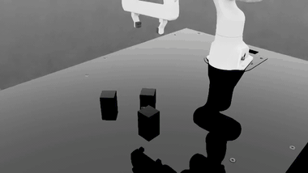
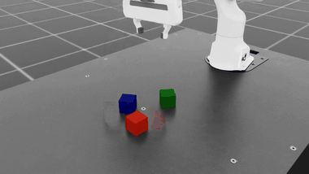
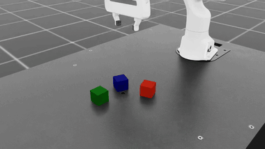
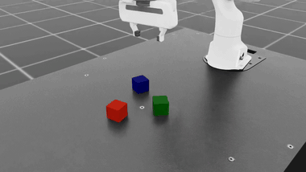

# mimic_the_mimicgen

Reproduce NVIDIA **Isaac Lab Mimic** end to end: take a handful of human
teleoperation demos and automatically multiply them into ~1000 synthetic demos
you can train on. Two tasks are included:

- **Franka — cube stacking** (single arm) — the **MimicGen** method.
- **GR1T2 — pick & place** (bimanual humanoid) — the **DexMimicGen** method
  (MimicGen extended to two arms: left arm picks, right arm places).

Everything heavy (Isaac Sim + Isaac Lab) runs inside NVIDIA's official Docker
container, so you only need a Linux box with an RTX GPU — no manual Python/CUDA
setup. The step scripts here just drive that container.

## Demos: human seed vs synthetic

MimicGen/DexMimicGen start from a few human demos and adapt them to new object
placements, replaying each in simulation and keeping the successful ones. Below:
the original **human** demo (left) next to a **synthetic** demo generated from
it (right). Full-quality MP4s are in [`demos/`](demos/).

### Franka — cube stacking (MimicGen, single arm)

10 human demos → 1000 synthetic demos (~37% generation success rate).

| Human seed demo | MimicGen synthetic |
|:---:|:---:|
|  |  |
|  |  |

### GR1T2 — pick & place (DexMimicGen, bimanual)

Pre-annotated human demos → 1000 synthetic demos (~87% generation success rate).

| Human seed demo | DexMimicGen synthetic |
|:---:|:---:|
|  |  |
|  |  |

### Bonus: my own demos, teleoperated over WebRTC

The sets above use NVIDIA's demos. These I recorded myself — teleoperating the
Franka from a laptop over WebRTC (the GPU server streams the viewport, the
laptop sends keyboard input; see `scripts/05_teleop_record.py`) — then generated
synthetic demos from them.

| My teleop demo (seed) | Synthetic generated from it |
|:---:|:---:|
|  |  |
|  |  |

## How it works

MimicGen splits each human demo into object-centric subtasks (grasp cube, place
cube, ...), transforms each subtask to wherever the objects are in a new
randomized scene, stitches the pieces together, and replays the result in
simulation — keeping only attempts that actually succeed. From ~10 human demos
it produces ~1000 synthetic ones.

DexMimicGen generalizes this to two arms: subtasks are defined per end-effector
(`left` / `right`), so a bimanual task like "left hand picks, right hand places"
can be generated the same way. In Isaac Lab both live in the same data generator
— single-arm tasks behave like MimicGen, multi-arm tasks like DexMimicGen.

## Requirements

- A Linux box with an **RTX GPU** (needs RT cores; e.g. L40S, RTX 6000, RTX 40xx).
- **Docker** + the **NVIDIA Container Toolkit** (so the container sees the GPU):
  ```bash
  docker run --rm --gpus all nvcr.io/nvidia/cuda:12.4.1-base-ubuntu22.04 nvidia-smi -L
  ```
  This should print your GPU. If not, install the container toolkit first.

## 1. Set up Isaac Lab (one time, on the GPU box)

Isaac Lab ships a Docker workflow that pulls NVIDIA's `isaac-sim` image and
builds on top of it. The first run downloads ~23 GB and takes a while; after
that it is cached.

```bash
git clone https://github.com/isaac-sim/IsaacLab.git
cd IsaacLab
# Build + start the container. It asks once about X11 forwarding; answer "n"
# on a headless server (we pipe it in here).
printf 'n\n' | python3 docker/container.py start
```

This creates a running container named **`isaac-lab-base`** with Isaac Sim 5.1 +
Isaac Lab inside, at `/workspace/isaaclab`. Handy commands:

```bash
python3 docker/container.py enter base   # shell inside the container
python3 docker/container.py stop         # stop + remove it
```

## 2. Run the demo pipeline (on the GPU box)

Clone this repo next to Isaac Lab and run the steps in order. Long runs are best
inside `tmux` so they survive an SSH drop. If your Isaac Lab clone is not at
`~/mimicgen_jihoonkwon/IsaacLab`, point `00` at it with `ISAACLAB_REPO=/path/to/IsaacLab`.

```bash
git clone https://github.com/JiH00nKw0n/mimic_the_mimicgen.git
cd mimic_the_mimicgen

# --- Franka (single arm, MimicGen) ---
python3 scripts/00_setup_container.py        # verify container + GPU
python3 scripts/01_download_dataset.py       # 10 human demos (HDF5)
python3 scripts/02_annotate.py               # auto-label subtask boundaries
python3 scripts/03_generate.py --mode small  # sanity check: 10 synthetic demos
python3 scripts/03_generate.py --mode full   # real run: ~1000 demos
python3 scripts/04_record_video.py           # render close-up MP4s

# --- GR1T2 (bimanual, DexMimicGen) ---
# Its dataset is already annotated, so step 2 is skipped.
python3 scripts/01_download_dataset.py --profile gr1t2
python3 scripts/03_generate.py --profile gr1t2 --mode small
python3 scripts/03_generate.py --profile gr1t2 --mode full
python3 scripts/04_record_video.py --profile gr1t2
```

What each step writes (under this repo):
- `datasets/source_dataset.hdf5` — the human seed demos
- `datasets/annotated_dataset.hdf5` — demos + subtask boundaries
- `datasets/generated_dataset.hdf5` — the ~1000 synthetic demos
- `outputs/videos/*.mp4` — rendered videos

Isaac Lab runs inside the container, so the scripts move datasets in/out with
`docker cp` automatically — you don't manage that.

## 3. Get the results onto your laptop

Code travels through git; the large datasets/videos are mirrored with rsync. On
your **laptop** (set `REMOTE` to your server's SSH host):

```bash
REMOTE=my-gpu-box bash setup/sync_from_remote.sh   # pulls datasets/ + outputs/
open outputs/videos/                               # watch the MP4s
```

Quick numeric summary + plots without a simulator:

```bash
pip install h5py matplotlib numpy
python3 scripts/04b_inspect_dataset.py
```

## Scripts

| Script | Stage | Runs on |
|--------|-------|---------|
| `scripts/00_setup_container.py` | Build + start the Isaac Lab container | GPU box |
| `scripts/01_download_dataset.py` | Download the human seed demos | GPU box |
| `scripts/02_annotate.py` | Auto-annotate subtask boundaries | container |
| `scripts/03_generate.py` | Generate ~1000 synthetic demos | container |
| `scripts/04_record_video.py` | Render close-up demo videos | container |
| `scripts/04b_inspect_dataset.py` | Summary + plots (no simulator) | laptop |
| `setup/sync_from_remote.sh` | Mirror datasets/videos to laptop | laptop |

Every step takes `--profile {franka,gr1t2}` (default `franka`).
`scripts/_common.py` holds the shared constants (container name, task names,
per-profile dataset URLs and camera angles); `scripts/_record_video_inproc.py`
runs inside the container during step 4. `notes/teleop_pipeline.md` lists the
raw Isaac Lab commands the scripts wrap.

## Credits

Built on [NVIDIA Isaac Lab](https://github.com/isaac-sim/IsaacLab). Methods:
MimicGen ([Mandlekar et al., 2023](https://arxiv.org/abs/2310.17596)) and
DexMimicGen ([Jiang et al., 2025](https://arxiv.org/abs/2410.24185)).
