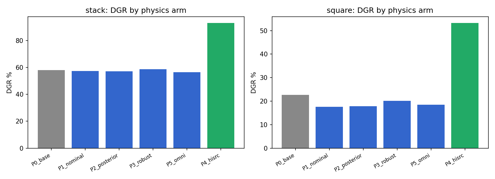
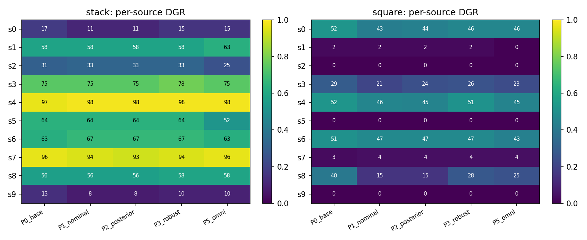

# Stage2 접촉 캘리브레이션 × MimicGen 생성 DGR Ablation

2026-08-02 실행 (aidas-l40s). FR3 실기 캘리브레이션 패키지 `stage2_contact_calibration_v2`
(2026-07-30 freeze, 지환님 전달)의 접촉 물리 파라미터를 robosuite MimicGen 생성 파이프라인에
이식하고, 물리 조건 5종 × hi-DGR 소스 선별 1종으로 생성 성공률(DGR)이 어떻게 변하는지 본
ablation. 정책 학습 없음, 생성 단계만. 코드: `motivation/genaudit/physics/`,
`motivation/genaudit/envs/physics_variants.py`, `motivation/scripts/stage2_*.py`.
원자료: 서버 `~/mimicgen_jihoonkwon/experiments/stage2_ablation/` (records JSONL 포함).

## 셋업

- 태스크 2종: stack(cube stack), square(peg-in-hole). IC variant는 N2로 고정해 물리만 변인.
- attempts 고정 설계(guarantee=False, keep_failed 무제한): stack 500/arm, square 900/arm
  (P4는 200/400). 총 7,600 attempts, 17청크, 5워커, 약 1.5시간.
- 물리는 attempt 단위로 샘플: 매 reset의 `_load_model()`에서 계약 공간 샘플 → 조립된 MJCF
  변경 → 실현값을 모델 XML의 custom numeric(`s2_*`)으로 기록 (demo마다 사후 검증 가능,
  smoke 게이트에서 geom 속성 == 기록값 교차검증 통과).
- MuJoCo 매핑: pair 마찰이 두 geom의 max 결합임을 이용해 테이블(1.9)·물체(0.652)·
  핑거패드(0.8)에 effective pair 값을 배치. 그리퍼 힘은 비율만 이식(계약 1.6 대비).
  restitution·감쇠·speed scale은 기록만 하고 미적용(본문 §6).

| arm | 내용 |
|---|---|
| P0_base | robosuite 기본 물리 (동일 코드경로 기준선) |
| P1_nominal | stage2 nominal 고정 |
| P2_posterior | posterior 2048행에서 행 단위 샘플 (보정 불확실성 내 DR) |
| P3_robust | robust_stochastic: 80% posterior-근방 + 20% 전범위, joint rule rejection |
| P5_omni | P3 + OmniReset Table 2 actuation DR (OSC gain, 관절 감쇠, 그리퍼 강성/감쇠) |
| P4_hisrc | P3 물리 + hi-DGR 소스 2개만 (stack {4,7}, square {0,4}) |

## 결과

| task | P0_base | P1_nominal | P2_posterior | P3_robust | P5_omni | P4_hisrc |
|---|---:|---:|---:|---:|---:|---:|
| stack | 58.0% | 57.4% | 57.2% | 58.6% | 56.4% | **93.0%** |
| square | 22.7% | 17.6% | 17.9% | 20.1% | 18.4% | **53.2%** |

(Wilson 95% CI는 stack ±4pp, square ±2.5pp 수준. P0가 기존 N2 6250-attempt 풀의
55.6%/23.1%를 CI 안에서 재현 — 물리 variant 서브클래스 경로가 기준선을 왜곡하지 않음.)

**1. stack 생성은 stage2 물리에 둔감하다.** 다섯 물리 조건이 전부 56–59%로 CI가 겹친다.
넓은 robust DR(테이블 마찰 1.25–2.6, 패드 마찰 0.65–1.3, 그리퍼 힘 ×0.63–1.25)을 걸어도
생성이 무너지지 않는다 — 이 물리 범위에서 cube stack 데이터 생성은 안전.

**2. square는 일관되게 3–5pp 내려가고, 그 근원은 소스별로 이질적이다.** nominal이 가장
낮고(17.6%) wide DR이 부분 회복(20.1%)하는 순서가 특징적. per-source로 쪼개면 페널티가
s8(40%→15%, nominal)과 s0(52%→43%)에 집중되고, s8은 robust에서 28%로 절반쯤 돌아온다.
계약의 패드 마찰(0.8)이 robosuite 기본(2.0)보다 크게 낮은 게 원인으로 보이며 — nominal은
0.8에 고정되지만 robust는 평균 0.98로 더 높은 마찰을 자주 샘플한다 — §4의 파라미터 곡선에서
square만 force_scale(22→29%)과 finger_mu에 양의 기울기가 있는 것과 정합적이다. 즉 square의
물리 민감성은 grasp 마찰 병목이고, 특정 소스(잡기 취약한 s8류)에 몰린다.

**3. per-source DGR 랭킹은 물리 변경에 거의 불변이다 (핵심 결과).** P0 기준 Spearman rank
상관이 stack 0.92–0.99, square 0.95–0.99. square의 죽은 소스 5개(s1·s2·s5·s7·s9, DGR 0–4%)는
어떤 물리에서도 살아나지 않았다. 실무적 함의: **소스 데모의 DGR 랭킹은 물리 파라미터를 바꿔도
그대로 이월되므로, 한 번 잰 hi-DGR 선별이 캘리브레이션된 새 물리·DR 환경에서도 유효하다.**

**4. hi-DGR 소스 선별은 randomized 물리에서도 그대로 작동한다.** P3와 같은 물리에서 소스만
top-2로 좁힌 P4가 stack 93.0%(vs 58.6%, 1.6배), square 53.2%(vs 20.1%, 2.6배). P3 안에서
같은 두 소스의 부분집합 DGR(96.4%/48.4%)과 CI 안에서 일치 — 시도를 몰아줘도 per-source
DGR이 변하지 않는다는 독립성 확인까지 겸한다. EXP-C(소스품질 인과)의 생성 측 예측이
물리 변경 하에서 재현된 것.

**5. 물리 파라미터 자체의 용량-반응은 이 범위에선 평평하다.** robust 풀(stack 1,200 /
square 2,200 attempts)에서 실현값 5분위 DGR 곡선의 Spearman이 전부 |ρ|≤0.05. 계약의
robust 범위는 두 태스크 모두 "생성이 급락하는 절벽" 바깥에 있다는 뜻이기도 하다(square의
grasp 축 약한 기울기 제외).

## 시각 DR 렌더 검증

low-dim 생성에서 시각 랜덤화는 DGR에 영향을 줄 수 없으므로 arm이 아니라 렌더 검증으로 수행:
P1/P3의 성공 demo 각 6개를 자기 물리 모델 그대로 재생하며 OmniReset Table 2 범위(카메라
±5cm/±2°/fovy±2, 텍스처·색·조명 랜덤화)로 렌더 → 서버 `~/stage2_render_dr/` (mp4 +
manifest.json, ref 클립 1개 + DR 클립 5개씩).

## Integration report (계약서 요구사항)

- 역할 매핑: table_cube→`table_collision` geom, cube_cube→cubeA/B·SquareNut·peg1/2 geom,
  finger_cube→핑거·패드 collision geom 4개, gripper force→position actuator forcerange 비율.
- 적용 확인: 생성 demo의 `model_file` XML에 실현값 내장(`s2_*` custom numeric), smoke에서
  geom 속성과 일치 검증. runtime: MuJoCo 2.3.2 / robosuite 1.4.1, dt=0.002(robosuite 기본),
  Panda(FR3 아님) — 계약 runtime(Isaac 5.1/PhysX/dt 0.001)과 다른 **new condition**.
- 미적용(기록만): restitution(MuJoCo 직접 파라미터 없음), 테이블 dynamic friction(MuJoCo는
  sliding 단일 계수), gripper speed_scale, 큐브 linear/angular damping(free joint 단일 스칼라
  제약 — 선형 등가값이 회전을 약 1000배 과감쇠해 의도적으로 배제).
- 부분 유효: 그리퍼 forcerange 상향은 servo 수요 한계 위에서 비활성. P5의 관절
  frictionloss/armature 배율은 Panda XML nominal이 0이라 비활성.
- square는 proxy 매핑(finger→nut, table→nut, cube_cube→nut-peg)임을 명기.

## 한계

- Panda + robosuite 기하(0.02–0.025m 큐브)에 FR3+50.7mm 실측값을 이식한 것이므로 절대
  충실도가 아니라 **조건 간 상대 비교**가 유효한 설계다.
- attempts 고정이라 arm 간 IC 분포는 동일 시드 체계로 맞췄지만 완전 paired는 아니다.
- square 페널티의 grasp-마찰 해석은 관찰 상관(소스별 회복 패턴 + force/finger 기울기)이며
  단일 파라미터 개입 실험으로 분리하진 않았다.
