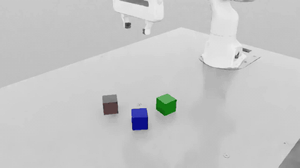
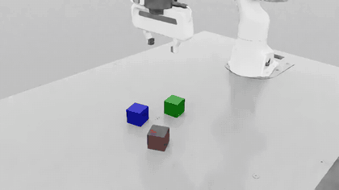
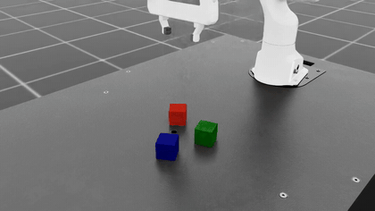
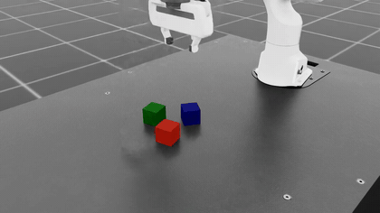
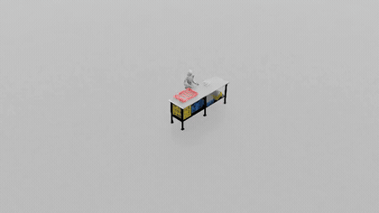
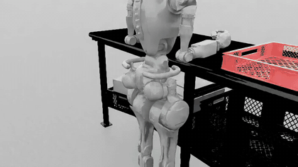
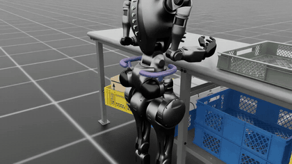
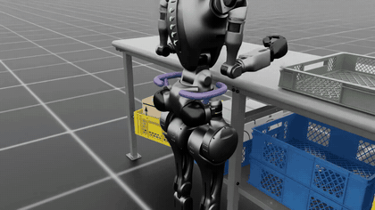

# Demos: human seed vs synthetic

Each run starts from a few human teleoperation demos and multiplies them into
~1000 synthetic demos. Below: the original **human** demo next to a **synthetic**
demo generated from it (replayed in simulation, rendered headless to MP4, shown
here as GIFs). Full-quality MP4s are alongside in this folder.

## Franka — cube stacking (MimicGen, single arm)

10 human demos → 1000 synthetic (~37% generation success).

| Human seed demo | MimicGen synthetic |
|:---:|:---:|
|  |  |
|  |  |

MP4 — human: [0](franka_human_0.mp4) · [1](franka_human_1.mp4) — synthetic: [0](franka_synthetic_0.mp4) · [1](franka_synthetic_1.mp4)

## GR1T2 — pick & place (DexMimicGen, bimanual humanoid)

Pre-annotated human demos → 1000 synthetic (~87% generation success). Left arm
picks, right arm places.

| Human seed demo | DexMimicGen synthetic |
|:---:|:---:|
|  |  |
|  |  |

MP4 — human: [0](gr1t2_human_0.mp4) · [1](gr1t2_human_1.mp4) — synthetic: [0](gr1t2_synthetic_0.mp4) · [1](gr1t2_synthetic_1.mp4)
