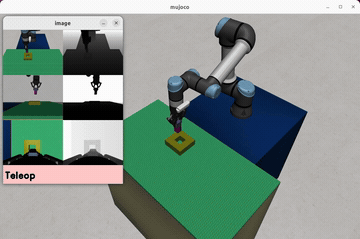
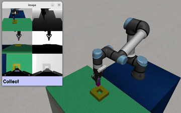
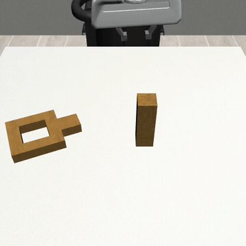
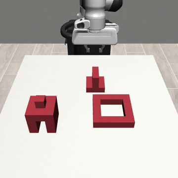
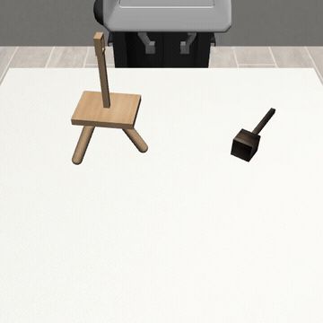

# CP-Gen · SART 데모 영상 — seed(데모) vs 생성 데이터

두 방법을 넣은 이유: **데모 몇 개를 peg-in-hole / gear assembly 같은 정밀 조립용 대량 데이터로 증강**하기 위해서다.
그래서 여기서는 "무엇이 seed 데모이고, 무엇이 거기서 생성된 데이터인지"만 본다.

---

## SART — Insert (peg-in-hole)

| seed 데모 (사람이 조종한 시연 1개) | 생성 데이터 (self-augmentation) |
|---|---|
|  |  |

UR5e가 노란 peg를 소켓에 삽입한다. **데모 1개**를 seed로, 삽입 지점 주변에서 다양한 접근 궤적을
안전하게 만들어 붙인다. 정밀 삽입 구간을 채우는 데 쓴다.

---

## CP-Gen — 조립 태스크 (생성 데이터)

seed는 **태스크당 데모 1개**. 아래는 거기서 생성된 궤적으로, 로봇이 집기 → 정렬 → 삽입/조립을 직접 수행한다.

| Square (peg-in-hole) | ThreePieceAssembly | Threading |
|---|---|---|
|  |  |  |

특징: 물체의 **위치뿐 아니라 형상(크기)까지 바꿔** 생성한다. 그래서 크기가 다른 gear/peg 인스턴스까지
한 데모에서 커버된다.

출처: CP-Gen https://cp-gen.github.io · SART https://sites.google.com/view/sart-il
