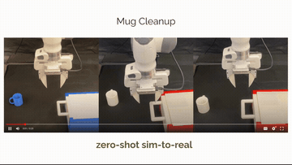
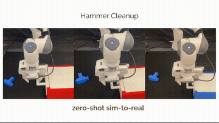
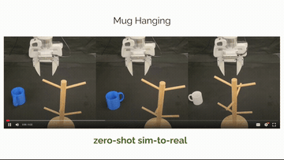
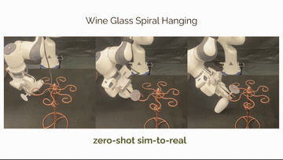

# 데모 영상 — task별 demo 성공 / 합성 성공 (GIF, 인라인 재생)

GitHub 마크다운에서 **GIF는 바로 재생**된다(`<video>` mp4는 인라인 재생 안 됨). 그래서 GIF를 기본으로 둔다.
원칙: **영상 하나 = 태스크 하나**(단일 태스크·단일 클립). 원본 mp4/전체 세트는 하단 참고.

---

## SART — Insert (peg-in-hole)
demo 성공 ↔ 합성 성공이 깔끔하게 대응되는 케이스. UR5e, 노란 peg를 소켓에 삽입.

| demo 성공 (사람 teleop) | 합성 성공 (경계 안 self-augment) |
|---|---|
|  |  |
| `Teleop (success)` — 원본 시연 1개 | `Collect` — 증강 궤적(다양한 접근→삽입) |

→ 우리 파이프라인 대응: `synthgen/sart_augmentor.py` (삽입 스킬 국소 증강)

---

## CP-Gen — Generated Trajectories (생성 궤적, 태스크별 1클립)
프로젝트 페이지의 **"CP-Gen Generated Trajectories"** 섹션. **로봇이 생성된 데모를 실제로 실행해**
집기 → 정렬 → 삽입/조립/threading 을 성공시키는 sim 궤적. 우리 목표 contact-rich 태스크.

| Square (peg-in-hole) | ThreePieceAssembly | Threading |
|---|---|---|
|  |  |  |

> 원본 섹션엔 Coffee / Kitchen / MugCleanup / HammerCleanup / StackThree 등 8개 태스크가 더 있다
> (https://cp-gen.github.io → "CP-Gen Generated Trajectories"). 여기선 peg/gear 관련 3개만 담음.

→ 우리 파이프라인 대응: `synthgen/pipeline.py` (생성) + `synthgen/cpgen_transform.py` (변환)

---

## CP-Gen — 실물 zero-shot 성공 (보충영상, 태스크별 1클립)
"데모 1개 → 1000개 합성 생성 → **학습된 정책이 실물에서 zero-shot 성공**". 아래는 그 실물 성공 롤아웃.

| Mug Cleanup | Hammer Cleanup |
|---|---|
|  |  |

| Mug Hanging (걸기=삽입 계열) | Wine Glass Spiral Hanging (끼우기 계열) |
|---|---|
|  |  |

---

## 원본 파일 / 출처
- GIF 원본 mp4: `sart/`, `cpgen/synthetic/` (Generated Trajectories). CP-Gen 실물 롤아웃은
  보충영상에서 추출(원본 81MB 미커밋 — https://cp-gen.github.io/media/videos/cpgen-suppl-video.mp4 )
- 전체 영상 세트: `robot_data workspace — augmentation_methods/*/videos/`
- 출처: CP-Gen https://cp-gen.github.io · SART https://sites.google.com/view/sart-il
