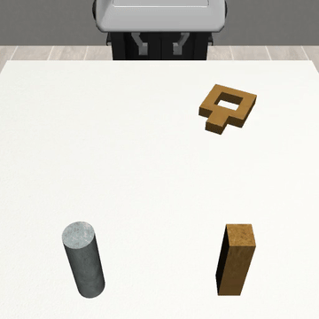
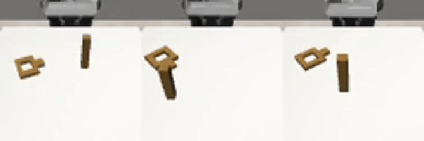

# mimicgen_substrate — SART · CP-Gen 을 robosuite MimicGen 에 **실제로 통합·검증**

이 폴더는 옆의 [`../synthgen`](../synthgen) 스캐폴딩(Isaac Lab + cuRobo 를 겨냥한 clean-room 설계)과 달리,
**지금 돌아가는 robosuite MimicGen 파이프라인 위에서 SART 와 CP-Gen 을 실제로 붙여 합성 데이터를 뽑고
검증한 결과물**이다. CPU 만으로 실행된다.

> **왜 MimicGen substrate 인가.** 팀 본 파이프라인(Isaac Lab SkillGen + cuRobo)은 무겁고 GPU 가 자주 막혀서,
> "SART/CP-Gen 이 MimicGen 계열 생성기에 **붙긴 하는가**" 를 먼저 값싼 프록시(square = peg-in-hole)에서
> 검증하는 걸로 대체했다. 여기서 붙는 걸 확인하고 → peg-in-hole / gear 로 넘어가는 순서.

## 결과 한눈에

| 방법 | 태스크 | DGR | 핵심 증강 축 | Falsifiable 검증 (검증 연극 방지) |
|---|---|---|---|---|
| **SART⊕MimicGen** | Square (peg-in-hole) | **55%** (33/60) | 접근(approach) **국소 다양성** | 같은-소스 접근 std **~1.5cm** vs 삽입부 verbatim **~0.1cm** → ≈15배 대비 (복붙 아님) |
| **CP-Gen⊕MimicGen** | SquareWide (크기 가변) | **35%** (7/20) | 물체 **크기(geometry) 일반화** | nut 크기 **1.41–1.54 (≈9% span)**, 성공=작은 nut / 실패=큰 nut → 크기→난이도 gradient 진짜 |

두 방법 모두 **MimicGen 의 rigid SE(3) transform 을 넘어서는 자기 고유의 축**을 실제 데이터로 만들어냈고,
그게 degenerate(복붙/무의미)가 아님을 반증 가능한(falsifiable) 지표로 확인했다.

### SART — 접근 다양성 (같은 삽입, 다른 접근)


### CP-Gen — 크기 일반화 (서로 다른 nut 크기로 삽입)


---

## 1. SART ⊕ MimicGen — 코어 재구현

**아이디어.** SART(=RoboManipAug)는 "삽입 같은 정밀 구간은 그대로 두고, 거기로 **가는 접근 경로만**
안전하게 다양화" 한다. 이걸 MimicGen 의 WaypointTrajectory 위에 재구현했다. 원본 SART repo 를 돌리는 대신
**우리 작동 중인 robosuite MimicGen venv 안에 ~200줄로 코어를 이식**(SART repo 는 RoboManipBaselines 종속이라
재구현이 정답).

**한 데모당 궤적 구성** (`sart/sart_mimicgen.py`, `build_traj`):
```
A' 수송(verbatim)  ──▶  offset 으로 우회  ──▶  수렴점으로 ONE-WAY  ──▶  정착  ──▶  C 삽입(verbatim)
tp[0:t_branch]         sampled sphere        tp[t_conv] 로 단조 수렴      k_fixed     tp[t_conv:T]
```
- 수송 + 타이트-공차 삽입은 **원본 그대로**, 접근만 다양화 → 삽입 성공률 보존하며 접근 분포만 넓힘.
- 실행은 robosuite 에서 mimicgen `WaypointTrajectory.execute` + `target_pose_to_action`(closed-loop OSC),
  **task success 로 필터**, robomimic 호환 HDF5 로 기록.

**핵심 수정(적대 검증이 잡아낸 함정).** 첫 구현은 offset 반경을 `min(r_max, 0.5*height)`로 캡했는데,
descent-onset(낮은 eef)에서 0 으로 붕괴 → 같은-소스 접근 std 0.0025m(복붙). `sample_offset` 을
**peg-top 에서 바닥 자른 full sphere** 로 고쳐서 1.5cm 접근 다양성 회복. → `sart/analyze_sart.py` 가
같은-소스 데모를 삽입부 END 로 정렬해 접근 std 프로파일로 이걸 정량 확인.

**실행** (arpa `robosuite_mimicgen/`, CPU):
```bash
python runs/sart_mimicgen.py --source datasets/generated/square_D0_poc/demo.hdf5 \
       --out datasets/generated/square_sart --n_sources 15 --n_per 4 --radius 0.06 --rot_deg 10
```

---

## 2. CP-Gen ⊕ MimicGen — 자체 repo 를 별도 env 로

**아이디어.** CP-Gen 은 MimicGen 계열의 변형으로, object-centric transform 에 **물체 geometry(크기) 샘플**을
더해 **크기가 다른 인스턴스까지** 커버한다(핵심: `get_scale_factor = current_obj_geom_size / demo_obj_geom_size`
로 키포인트 제약을 물체 크기 비율만큼 스케일). 이 "크기 일반화" 는 **scale-setting env(`SquareWide`, cpgen-envs)**
가 있어야 성립하는데, 우리 robosuite 1.4.1 의 SquareNut 은 scale 파라미터가 없다. 그래서 CP-Gen 은
**재구현이 아니라 자체 repo 를 별도 venv 에 설치해** 돌렸다(우리 mimicgen venv 는 무수정).

**설치가 곧 작업이었다 — 버전 지뢰 3개를 해체**(전체 레시피 → [`cpgen/RUN.md`](cpgen/RUN.md)):
1. **torch↔torchvision** 불일치 → CPU 매칭 버전 force-reinstall (`torchvision::nms does not exist` 해결).
2. **mujoco 버전** → forked robosuite 1.5.1 이 옛 `mj_fullM(m, dst, M)` 시그니처를 써서 **`mujoco==3.2.6` 강제**
   (3.3+ 는 `(m, d, dst)` 로 바뀌어 터짐).
3. **mink `_frame_id_cache`** → cpgen `IndexedConfiguration.__init__` 이 `super().__init__()` 을 스킵해
   mink 가 기대하는 캐시 dict 가 없음 → **`self._frame_id_cache = {}` 한 줄** 추가.
   
   추가로 curobo/nerfstudio 는 **안 깔고 import 만 lazy/stub 패치**(`cpgen/patch_cpgen.py`) → `eef_interp`(CPU) 경로로 실행.

**실행** (stdin 으로 interaction 넘김 — body 이름: nut=`SquareNut_main`, peg=`peg1`):
```bash
echo "gripper0_right_right_gripper:SquareNut_main,SquareNut_main:peg1" | python demo_aug/generate.py \
  --cfg.demo-path src/source/square.hdf5 --cfg.env-name SquareWide \
  --cfg.motion-planner-type eef_interp --cfg.demo-segmentation-type distance-based \
  --cfg.override-interactions --cfg.no-download-demo --cfg.n-demos 20 --cfg.save-dir ../out/run1
```

**결과.** DGR 35%(7/20). 생성된 데모의 nut 크기가 1.41–1.54 로 실제로 다양(=크기 일반화 작동), 그리고
**가장 큰 nut 은 전부 실패 / 가장 작은 nut 은 성공** 하는 크기→난이도 gradient 가 반증 가능하게 드러남
(고정 공차 구멍에 큰 nut 삽입이 더 어려움). → `cpgen/analyze_cpgen.py`, `cpgen/squarewide_run_stats.json`.

---

## 3. 폴더 구조

```
mimicgen_substrate/
├── README.md                     ← 이 문서
├── sart/
│   ├── sart_mimicgen.py          SART 코어 (robosuite MimicGen 위 재구현)
│   ├── analyze_sart.py           접근 다양성 falsifiable 지표
│   ├── play_sart_playback.py     mimicgen import 주입한 robomimic 재생 래퍼
│   └── square_sart_stats.json    DGR 55%, offset std 등
├── cpgen/
│   ├── RUN.md                    설치·실행 재현 레시피 (버전 지뢰 3개)
│   ├── clone.sh                  cpgen/cpgen-envs/robosuite_scale 클론
│   ├── install_cpgen.sh          별도 venv 린 설치 (curobo/nerf 없이)
│   ├── patch_cpgen.py            curobo/nerf import lazy/stub 패치
│   ├── analyze_cpgen.py          nut 크기 spread + 성공/실패 gradient
│   └── squarewide_run_stats.json DGR 35%, 크기별 성공/실패
└── media/
    ├── sart_square_mimicgen.gif/.mp4    SART 증강 square 6개
    └── cpgen_squarewide.gif/.mp4        CP-Gen SquareWide 3개(크기 다름)
```

> 코드/데이터 정본은 arpa `~/mimicgen_jihoonkwon/` (SART=`robosuite_mimicgen/`, CP-Gen=`cpgen_stack/`).
> 여기엔 스크립트·통계·데모 영상만 싱크(대용량 venv/repo/*.hdf5 는 제외).

## 4. 한계 · 다음

- **peg-in-hole 은 사실상 커버됨**(square = NutAssemblySquare = peg-in-hole). 두 방법 다 붙는 것 검증 완료.
- **gear 는 여전히 난제**: robosuite / MimicGen / cpgen-envs 어디에도 gear 태스크·에셋이 없다 → 신규 저작 필요
  (Isaac Lab SkillGen 때와 같은 벽).
- **더 엄밀한 value-add 검증**(선택): 고정 N 에서 BC 정책을 {base} vs {base+SART} vs {base+CP-Gen} 로 학습해
  held-out 에서 성공률 비교 → "증강 데이터가 단순 데이터 추가보다 나은가" 를 CI 로.
