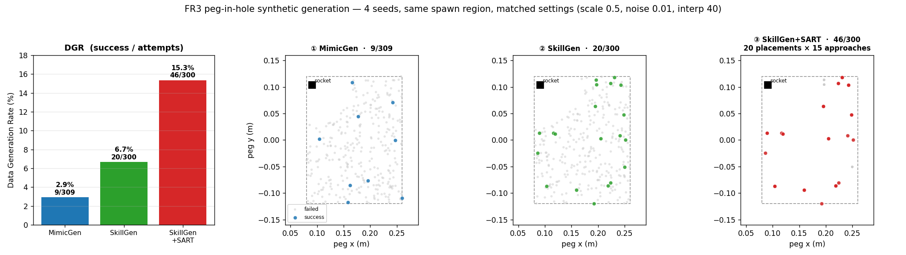

# FR3 peg-in-hole 합성 생성기 비교 (Isaac Lab)

**세팅:** 동료 teleop 12개 → **replay-success 게이트 통과 4개**를 시드로. 같은 spawn 영역(x[0.08,0.26], y[-0.12,0.12]), 같은 매칭 설정(IK scale 0.5, action_noise 0.01, num_interpolation_steps 40), 고정 ~300 시도 예산. 모두 aidas L40S · isaac-lab 3.0 컨테이너, 헤드리스.

## 결과

| 셀 | DGR | 초기조건(IC) 커버리지 | 접근 다양성 | GPU util |
|---|---|---|---|---|
| ① MimicGen | **2.9%** (9/309) | 영역 전체, 쏠림 X | — | ~30% |
| ② SkillGen | **6.7%** (20/300) | 영역 전체, 쏠림 X | — | ~25% |
| ③ SkillGen+SART | **15.3%** (46/300) | 20개 배치 × 15 접근 | **offset std 0.022 m** | ~30% |

성공 데모 전부 기하 삽입 재검증 통과(radial<1mm, depth 38mm, upright 1.0), 성공항 오분류 0.

## 핵심 발견

1. **SkillGen ≫ MimicGen (신규 IC 생성): 6.7% vs 2.9% (2.3배).** cuRobo가 자유공간 접근을 계획해 오픈루프 삽입 구간을 짧게 만들어 드리프트를 줄임 — 1mm 공차 삽입에서 결정적.
2. **논문 스펙(noise 0.03)이면 MimicGen은 0%.** 30mm peg/32mm bore(1mm 공차)에 0.03m 노이즈가 수백 IK 스텝에서 cm급으로 누적. noise 0.01로 낮춰야 비로소 성공. → tight 삽입은 vanilla MimicGen의 약점.
3. **SART는 "신규 IC 생성기"가 아니라 "고수율 증폭기+접근 다양화기".** SkillGen 성공 20개를 각각 15개 접근으로 재시도해 **46개(2.3배)** 로 늘리고 접근 궤적 다양성(offset std 0.022m)을 추가. **배치(IC)는 그대로 20개** — SART는 접근만 다양화하지 물체 배치를 넓히지 않음. 그래서 15.3%는 "쉬운(이미 성공한) 배치에서의 재시도 성공률"이라 ①②의 "신규 배치 성공률"과 분모가 다름.
4. **성공이 쉬운 IC로 안 쏠림.** ①②에서 성공이 시드 근처가 아니라 영역 전체(시드에서 먼 high-x 포함)에 퍼짐 → 난이도는 물체 위치가 아니라 **tight tolerance(균일)** 가 지배. (이전 motivation 실험의 "IC 위치 편향 약함"과 일치.)
5. **GPU 80~90% 포화는 세 셀 다 구조적으로 불가.** MimicGen=단일스레드 asyncio 오케스트레이터, SkillGen=cuRobo trajopt가 4코어 CPU 바운드, SART=경량 IK 재생. 전부 CPU 바운드라 GPU 최대 ~30%(VRAM 2~29GB). 포화가 목표면 승자 셀에서 병렬 프로세스 여러 개로 채우는 게 유일한 길.

## 결론 (승자)

- **신규 초기조건에서 성공률 최고 = SkillGen** (6.7%, MimicGen의 2.3배).
- **최종 데이터셋 최적 = SkillGen + SART**: SkillGen이 넓은 IC 커버리지를 만들고, SART가 각 성공을 2.3배로 증폭하며 접근 궤적 다양성을 더함 → IC 다양성 × 접근 다양성 둘 다 확보한 46개.

## 한계 / 다음

- **시드 4개는 얇음**(12→4, 오픈루프 replay 게이트에서 탈락). 동료가 데모 더 주면 재실행으로 절대 DGR·데이터셋 규모 강화.
- 절대 DGR이 낮은 건 1mm 공차 자체 때문. clearance를 조금 늘린 변형이나 접촉 인지 삽입(force/impedance)이 후속 레버.
- (선택) ④ MimicGen+SART를 돌리면 2×2 완성 — SART가 MimicGen에도 같은 배율로 붙는지 확인.
- (선택) 승자(SkillGen+SART)를 큰 예산 + 병렬 프로세스(GPU 포화)로 스케일해 실제 학습용 데이터셋 생산.

**산출물(aidas ~/peg_work/):** `gen_mimicgen.hdf5`(9), `gen_skillgen.hdf5`(20), `gen_skillgen_sart.hdf5`(46) + 각 `_failed` + `ic_*.csv`. 코드: `~/peg_work/lab_peg_mimic/` (전부 신규 파일, 기존 템플릿·원본 무수정).
