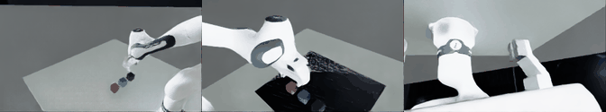
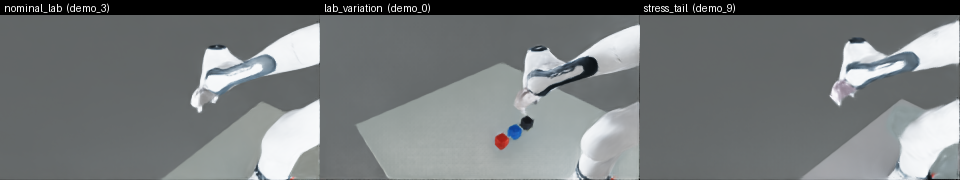

# RGB-Action 데이터 생성 파이프라인 (작업 3)

작성 2026-08-05, MimicGen팀. MimicGen으로 증폭한 3-큐브 쌓기 시연에 실측 카메라 시점의
영상을 붙이고, RL팀의 시각 랜덤화 규격을 적용해 (영상, 계약 행동) 학습 데이터를 만드는
파이프라인의 구현·검증 기록이다. 이 문서만으로 재현할 수 있게 명령과 수치를 모두 적었다.

## 0. 결과물



왼쪽부터 `third_person_0`, `third_person_1`, `wrist`. 실측 캘리브레이션대로 배치한
카메라 3대가 실험실 책상 위 작업면을 비추고, 큐브 색은 시각 랜덤화 계약의 실측 실험실
값(빨강·파랑·검정)이다. 320×180으로 렌더한 원본을 문서용으로 0.7배 축소해 3프레임마다
추렸다.

시각 랜덤화 프로파일 세 종류가 같은 카메라에서 어떻게 다른지(조명·색조가 조금씩 다르다):



## 1. 입력물

| 무엇 | 어디서 | 이 작업에서 쓰는 부분 |
|---|---|---|
| 증폭된 시연 | 서버 `~/contract_out/gen_flip_25.hdf5` (사람 소스, 받침 방향 교정 후 생성한 25개 성공분) | `states/` 전 프레임(로봇 관절·큐브 자세) — 상태 재생 렌더링의 입력 |
| 카메라 캘리브레이션 | 저장소 `render/fr3_camera_overlay_v2/overlay.yaml` — **2026-07-28 실측판**(`fr3_four_camera_v4_measured_20260728`) | 고정 D435 3대 + 손목 D405 1대의 장착 위치·렌즈 |
| 씬 바인딩 | 저장소 `render/fr3_binding_v2.yaml` | 캘리브레이션 프레임(`fr3v2_link0`)과 우리 씬 프림(`fr3_link0`)의 대응. `probe_tcp_binding.py`가 시뮬에서 측정해 만들며, 로더가 `ready_to_apply`와 판본 일치를 강제한다 |
| 실험실 책상 | 서버 `~/fr3_visual_randomization_v1/assets/table/table_scene.usdc` | 상판 z=0.722 m — 우리 씬의 책상 높이(0.720)·로봇 받침 높이와 일치 |
| 시각 랜덤화 규격 | `fr3_visual_randomization_handoff_v1_320x180` (RL팀, 2026-08-04) | 프로파일 혼합·색·재질·HDRI·카메라 오차 범위 |

## 2. 실행 방법

```bash
# 서버(aidas)에서. 경로는 컨테이너 내부 기준(/repo=저장소, /out=~/contract_out,
# /vrand=~/fr3_visual_randomization_v1)
cd ~/mimicgen_jihoonkwon/mimic_the_mimicgen

# (0) 카메라 캘리브레이션 신판으로 overlay를 만들고 바인딩을 다시 측정 (한 번만)
python3 render/build_overlay_from_measured.py --output render/fr3_camera_overlay_v2/overlay.yaml
#   probe는 Isaac 안에서: render/probe_tcp_binding.py --overlay <v2> --out render/fr3_binding_v2.yaml

# (1) 영상: 카메라 4대를 320x180으로 렌더 + 시각 랜덤화(50/40/10 혼합)
render/run_render_aidas.sh --dataset /out/gen_flip_25.hdf5 --count 10 \
    --width 320 --height 180 --vrand mixture --vrand_seed 7 \
    --overlay /repo/render/fr3_camera_overlay_v2/overlay.yaml \
    --binding /repo/render/fr3_binding_v2.yaml \
    --table_usd /vrand/assets/table/table_scene.usdc \
    --output /out/rgb_final10.hdf5

# (2) 행동: 같은 시연을 계약 형식(10 Hz)으로 변환
contract/run_convert_aidas.sh --dataset /out/gen_flip_25.hdf5 \
    --output /out/gen_flip_25_contract.hdf5 --count 25 --source_hz 20

# (3) 결합: 영상(20 Hz)과 계약 행동(10 Hz)을 인덱스로 짝지어 최종 데이터셋
python3 contract/join_rgb_contract.py --rgb /out/rgb_final10.hdf5 \
    --contract /out/gen_flip_25_contract.hdf5 \
    --output /out/rgb_action_final10.hdf5
```

주의: Isaac 작업 두 개(렌더와 생성)를 동시에 돌리면 자원 충돌로 한쪽이 죽는다. 순차로
실행한다.

## 3. 구현한 것

- `render/run_render_aidas.sh` — 렌더러의 aidas 도커 실행 래퍼. 기존 `run_render.sh`는
  사라진 arpa 서버의 가상환경 전용이라 이 서버에서는 쓸 수 없었다.
- `render/build_overlay_from_measured.py` — 2026-07-28 실측 캘리브레이션
  (`camera_nominal_measured_ranges.yaml`)을 렌더러가 읽는 overlay 형식으로 변환한다.
  구판 overlay를 구조 틀로 쓰되 카메라 외부·내부 파라미터만 교체한다. 로봇 쪽 항목
  (좌표 규약, 프레임 의미, 바인딩 프로브가 맞추는 기준 자세)은 카메라 재캘리브레이션과
  무관하므로 그대로 둔다. 로더가 모든 쿼터니언을 행렬에서 다시 유도해 대조하므로 출력은
  구조적으로 일관된다.
- `render/visual_randomization.py` — RL팀 규격의 재구현. 그들의 `source/events.py`는
  IsaacLab 매니저 기반 이벤트(에피소드 리셋 시 발화)라 상태 재생 루프인 우리 렌더러에서는
  실행되지 않는다. 그래서 옮긴 것은 코드가 아니라 계약이며, 숫자는 그들의 YAML을 직접
  읽어 쓴다. 적용 범위는 그들의 `scope_contract`를 따른다: 프로파일·HDRI·바닥은 프로세스
  단위, 카메라 자세·초점과 물체 재질은 에피소드 단위, 에피소드 중간 변경 없음.
- `render/render_viewpoints.py` — `--vrand {nominal_lab|lab_variation|stress_tail|mixture}`
  플래그 추가. `mixture`는 에피소드를 50/40/10으로 정확히 배분한다(이항 추출이 아니라
  최대잉여법).
- `contract/join_rgb_contract.py` — 영상과 계약 행동의 결합. 길이비가 정수가 아니면
  조용히 어긋나게 붙이는 대신 그 에피소드를 거부한다.
- `render/diag_camera_world.py` — 렌더 시점 카메라 월드 자세 진단(4절에서 쓴 도구).
- `render/make_preview_gif.py` — 문서용 GIF 생성.

## 4. 찾아서 해결한 결함 두 가지

### 4-1. 카메라가 작업면 대신 바닥을 비추던 문제

첫 렌더는 정상 종료했지만 고정 카메라 2대가 바닥만 비췄다. 추적 순서는 이랬다.

1. 캘리브레이션 값으로 시선을 손계산하니, 로봇 받침이 180° 회전한 상태라면 세 카메라
   모두 큐브를 담아야 했다. 관측과 반대였다.
2. 받침이 회전하지 않은 경우로 계산하니 관측과 정확히 일치했다.
3. `render/diag_camera_world.py`로 시뮬이 보고하는 카메라 월드 좌표를 직접 읽어 확정:
   카메라 프림은 매 프레임 써넣는 받침 자세가 아니라 **스폰 시점의 자세**를 따르고
   있었다. 관절 재생은 써넣은 자세를 쓰므로 로봇과 카메라가 180° 어긋났다.
4. 조치: 렌더 경로에서 스폰 회전을 실제 180°가 되도록 지정한다
   (`LAB_ROBOT_SPAWN_ROT=0,0,1,0`, `run_render_aidas.sh`가 기본으로 넘긴다).

효과: 고정 카메라 third_person_0의 시선이 책상면과 만나는 지점과 가장 가까운 큐브의
거리가 **0.99 m → 0.15 m**, 손목 카메라는 **1.01 m → 0.095 m**로 줄었다.

### 4-2. 생성 데이터의 받침 좌표계가 실기와 180° 반대였던 문제

4-1을 파고들다 더 근본적인 문제가 나왔다. 사람이 직접 조종해 녹화한 원본은 팔이
정면으로만 뻗고(1번 관절 −0.13에서 0.14 라디안) 큐브가 받침 +x에 놓이는데, MimicGen이 생성한
에피소드는 1번 관절이 2.18 라디안(125°)까지 돌아가고 큐브가 받침 −x에 놓였다. 실측
캘리브레이션 카메라의 화각에 작업면이 들어오려면 작업면이 +x여야 하므로, 생성 데이터는
실기와 180° 반대였다.

원인은 설정값 한 줄의 의미가 버전 변경으로 뒤집힌 것이다. 로봇이 책상을 마주 보도록
z축 180° 회전을 의도해 적은 `rot = (0,0,0,1)`이 예전 규약(w,x,y,z)에서는 180° 회전이지만
지금 버전은 스폰에서 (x,y,z,w)로 읽어 무회전이 된다. 큐브는 절대 좌표로 배치되고 1번
관절이 ±166°까지 돌아가므로, 로봇이 뒤를 보고 서 있어도 작업은 성공해 오류로 드러나지
않았다.

조치는 생성 환경(`lab_stack_mimic/lab_mimic_cfg.py`)에도 같은 `LAB_ROBOT_SPAWN_ROT`
스위치를 넣고 의도했던 180° 회전으로 다시 생성하는 것이다. 결과는 두 가지다.

- 기하가 바로잡혔다: 1번 관절 사용 범위 ±2.0–2.4 → −0.37에서 0.44 라디안(사람 원본과 같은
  정면 작업).
- 생성 수율이 유의하게 올랐다: **25/201 = 12.4%**(95% CI 8.6–17.7) vs 교정 전
  25/385 = 6.5%(4.4–9.4), 1.9배, 두 비율 z-검정 z=2.45, p=0.014.

## 5. 최종 데이터셋과 검증

교정된 데이터로, 실험실 책상과 2026-07-28 캘리브레이션을 써서 다시 만들었다.

| 항목 | 값 |
|---|---|
| 파일 | 서버 `~/contract_out/rgb_action_final10.hdf5` (274 MB) |
| 에피소드 / 샘플 | 10개 / 1,760 스텝 (에피소드당 176, 10 Hz) |
| 카메라 | `third_person_0`, `third_person_1`, `wrist` — 각 180×320×3 uint8 |
| 카메라 캘리브레이션 | `fr3_four_camera_v4_measured_20260728` (신판) |
| 프로파일 분포 | nominal_lab 5, lab_variation 4, stress_tail 1 |
| 계약 스키마 검증 | PASS |
| 이미지 대비(계약 게이트 `min_rgb_std` 10.0) | 47.8–49.7 |
| 행동 크기(위치) | p50 0.208 / p95 0.799 / p99 1.124 |

좌표계 일관성 검증(4-2가 해결됐는지 확인하는 지표):

- 큐브가 받침 **+x**(0.41–0.48 m)에 있다 — 실기와 같은 쪽.
- 손끝 시작 위치도 +x(0.33 m) — 팔이 정면에서 작업한다.
- 고정 카메라 두 대 모두 **10/10 에피소드에서 큐브 3개가 전부 화면 안**이다(교정 전
  같은 검사에서는 0/9였다).

즉 영상과 행동이 같은, 실기와 일치하는 받침 좌표계에 있다. 행동 크기도 교정 전보다
작아졌다(p95 1.088 → 0.799): 팔이 125°씩 돌지 않아도 되기 때문이다.

## 6. 남은 한계

1. **커튼·벽 등 방 구조는 아직 없다.** 시각 랜덤화 계약에는 커튼 색·재질 항목이 있지만
   우리 씬에는 대응 프림이 없어 제외했다(코드가 `skipped`로 보고한다). 책상·바닥·물체·
   조명은 모두 적용된다.
2. **다중 환경 픽셀 격리 게이트는 해당 없음.** 계약의 `max_foreign_pixels_per_camera_env: 0`은
   여러 환경을 타일로 배치해 학습할 때 옆 환경이 새어 들어오는지 보는 검사다. 우리는 한
   번에 한 환경만 렌더하므로 구조적으로 발생하지 않는다.
3. **규모.** 이번 산출물은 10 에피소드짜리 시험 규모다. 학습용으로는 교정된 설정으로
   생성 수를 늘려 같은 절차를 반복하면 된다(파이프라인·형식은 그대로).
