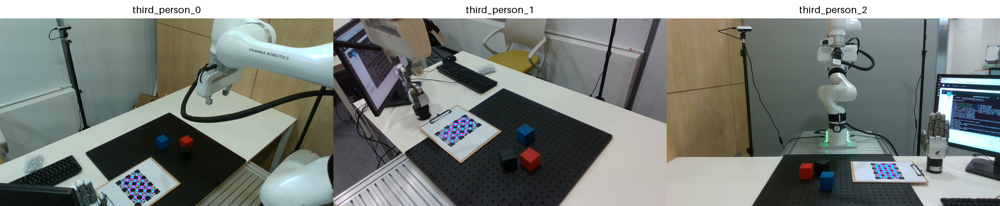
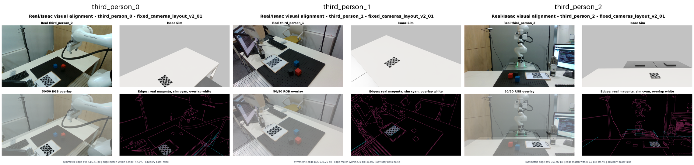

# FR3 Fixed-Camera Real/Isaac Overlay V2

- Condition: `fixed_cameras_layout_v2_01`
- Scope: board/table geometric inspection with robot and random cubes hidden in Isaac
- Board projection: observed board pose versus calibrated Isaac projection on the selected real frame
- Whole-image edge metrics: advisory only because the real room contains geometry absent from the simulation

| Camera | Serial | Pose method | Detection RMSE | Board projection RMSE | Board max | Whole-image edge p95 |
|---|---:|---|---:|---:|---:|---:|
| third_person_0 | 405622073775 | charuco | 0.185 px | 0.032 px | 0.048 px | 515.71 px |
| third_person_1 | 405622072503 | charuco | 0.230 px | 0.037 px | 0.056 px | 533.25 px |
| third_person_2 | 401622073398 | chessboard_fallback | 0.345 px | 0.014 px | 0.029 px | 351.00 px |

`third_person_2` uses a chessboard fallback from an oblique board view. Confirm its board orientation visually before accepting it as final.

The board projection metric reconstructs the calibration observation and is not an independent validation. The real/Isaac comparison images remain the visual check for rendering and scene-frame mistakes.

The current Isaac scene includes the registered white table but does not yet model the movable black threaded plate, room furniture, cables, or the exact real robot pose. Whole-image edge failure is therefore expected and must not be used as a camera-extrinsic rejection gate.

In the board projection figure, magenta circles are the observed board points and cyan crosses are the calibrated Isaac projections.

